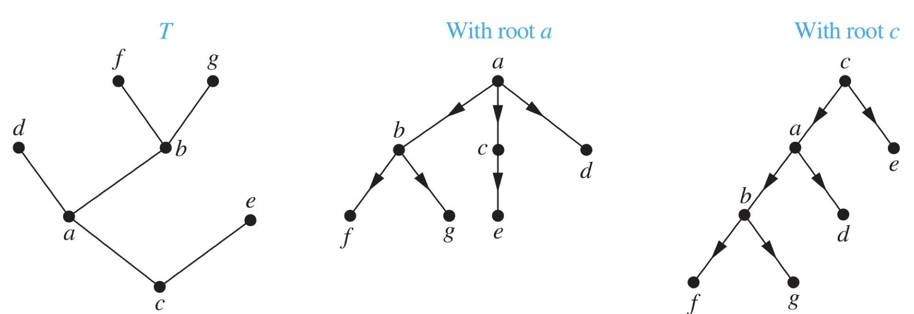
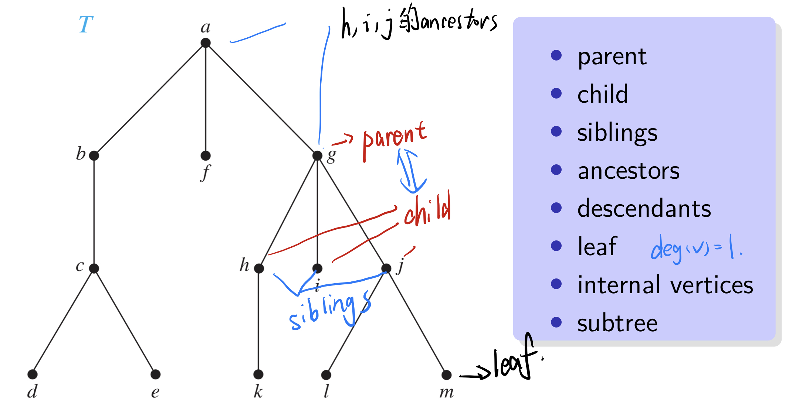
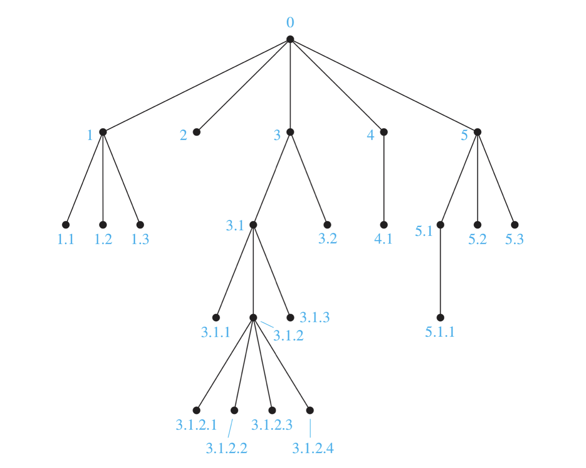
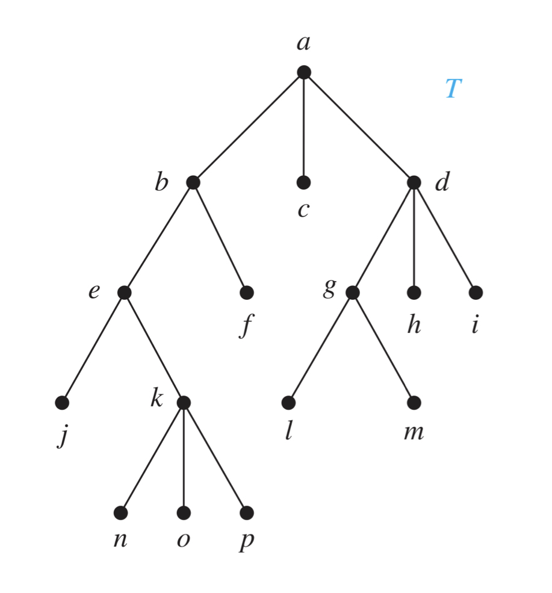

Tree 

# Introduction to Trees

## Trees

+ A tree is a connected **undirected graph** with **no simple circuits**.
  + 没有简单回路
+  An undirected graph is a tree **if and only if** there is a **unique simple path** between **any two of its vertices**.

注意：

> + A tree **cannot** contain multiple edges or loops.
> + Any tree must be a **simple graph**.

## Rooted Trees

+ A rooted tree is a tree in which **one vertex has been designated as the root** and every edge is directed away from the root.
+ 

## N-ary Trees n叉树

+ A rooted tree is called an **m-ary tree** if every internal vertex has no more than m children.
+ The tree is called a **full m-ary tree** if every internal vertex has exactly m children.
+ An m-ary tree with m = 2 is called a **binary tree**.

## Ordered Rooted Trees

> An ordered rooted tree is a rooted tree **where the children of each internal vertex are ordered**.

+ In order from left to right 
+ Given a binary tree
  + left child
  + right child
  + left subtree 
  + right subtree

## #Properties of Trees

> A tree with $n$ vertices has $n − 1$ edges.

下面这个公式非常重要！！！！！！！！

> A **full m-ary tree** with $i$ internal vertices contains $n = mi + 1$ vertices.    

$$
n=mi+1
$$

> + A full m-ary tree with
>   + $n$ vertices have $i = (n−1)/m$ internal vertices and $l = [(m − 1)n + 1]/m$ leaves,
>   + $i$ internal vertices have $n=mi+1$ vertices and $l=(m−1)i+1$ leaves,
>   + $l$ leaves have $n=(ml−1)/(m−1)$ vertices and $i=(l−1)/(m−1)$ internal vertices.
> + 这些都不用记住，只要记$n=mi+1$和$l=n-i$
> + 叶子就是除了内点之外的点

### Level and Height

+ The **level** of a vertex $v$ in a rooted tree is the **length** of the unique path from the root to this vertex.
+ The level of the root is defined to be **zero**.
+ The **height** of a rooted tree is the **maximum** of the levels of vertices.
+ A rooted $m-ary$ tree of height $h$ is **balanced** if all leaves are at levels $h$ or $h − 1$.

#There are at most $mh$ leaves in an $m-ary$ tree of height $h$. 

+ If an $m-ary$ tree of height $h$ has $l$ leaves, then $h ≥ ⌈log_m l⌉$.
+ If the m-ary tree is full and balanced, then $h = ⌈log_m l⌉$.

# Application of Trees

# Tree Traversal

## Universal Address Systems

## #Traversal Algorithms

###  Preorder Traversal 前序遍历

+ 首先访问根结点，然后前序遍历其左子树，最后前序遍历其右子树

+ Let $T$ be an ordered rooted tree with root $r$.
  + If $T$ consists only of $r$, then $r$ is the preorder traversal of $T$.
  + Otherwise, suppose that $T_1, T_2, · · · , Tn$ are the subtrees at r from left to right in T. The preorder traversal begins by visiting r.
  + It continues by traversing $T_1$ in preorder, then $T_2$ in preorder, and so on, until $T_n$ is traversed in preorder.
+ $abejknopfcdglmhi$
+ 

###  Inorder Traversal 中序遍历

+ 首先中序遍历根结点的左子树，然后访问根结点，最后中序遍历其右子树。
+ $jenkopbfaclgmdhi$

### postorder traversal 后序遍历 

+ 首先后序遍历根结点的左子树，然后后序遍历根结点的右子树，最后访问根结点。
+ $jnopkefbclmghida$

## Infix, Prefix, and Postfix Notation

### prefix form

+ We obtain the prefix form of an expression when we traverse its rooted tree in **preorder.**
+ 

# Spanning Trees

树有三大要素：

1. 连通；
2. 无环 (没有回路)；
3. 无向；

+ 如果一个图满足上面三个条件，那么这个图一定是树。

# Minimum Spanning Trees

