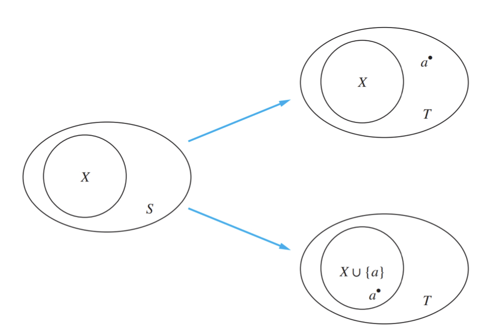

本文参考[浙大计院的NC的离散数学详解 Discrete Mathematics Explained in DetailJ](https://github.com/iamNCJ/Discrete_Mathematics_Explained_in_Detail)，仅用于复习巩固

 Chaptcer 03 Induction 归纳

# Mathematical Induction数学归纳法

## Framework 基本框架

Prove $\forall nP(n)$ by mathematical induction:

1. **Basis step** : Establish P(1)

2. **Inductive step** : Prove that $P(k)\to P(k+1) \ \text{for}\ k\geq  1$

- **Conclusion**:  $$\forall nP(n)$$, where the domain is the set of positive integers 

Express this in the proposition form:

$$(P(1)\wedge\forall k(P(k)\to P(k+1)))\to\forall nP(n)$$

This is the (first) principle of Mathematical Induction, and it also has the following form
$$P(1)\\\underline{\forall k(P(k)\to P(k+1))}\\\therefore\forall nP(n)$$

## The Good and Bad of Mathematical Induction

### The Good

- can be used to prove a conjecture once it is has been made and is true

### The Bad

- Proofs do not provide insights as to why theorems are true

  > You can prove a theorem by M.I. even if you do not have the slightest idea why it is true!

- Cannot be used to find new theorems

注意：

> 数学归纳法只能用于证明结果，不可以用于发现公式定理之类的。（大概这个翻译，英语不行）

## Examples

> 1⃣️Use mathematical induction to prove the inequality $n < 2^n$
>
> $$k+1<2^k+1≤2^k+2^k =2·2^k =2^{k+1}$$
>
> 2⃣️Use mathematical induction to prove that $2^n < n!$ for every integer n with n ≥ 4.
>
> $$2^{k+1}=2\times 2^k<2\times k!<(k+1)k!=(k+1)!$$
>
> 3⃣️ **An Inequality for Harmonic Numbers**（调和级数）
> $$H_j = 1 + \frac12 + \frac13 + · · · + \frac1j$$ .
> Use mathematical induction to show that
> $$H_{2^n} ≥ 1 + \frac n2$$ ,
> whenever n is a nonnegative integer.
>
> 
>
> 4⃣️ **The Number of Subsets of a Finite Set**
> Use mathematical induction to show that if S is a finite set with n elements, where n is a nonnegative integer, then S has $2^n$ subsets.
>
> Solution:$T = S∪\{a\}$
>
> 即，有两种情况，第一种是和原来的一起，另一种是不和原来的一起（语言表达能力拉胯）
>
> 

## The Validity of Mathematical Induction 数学归纳法的有效性

+ 正整数集合的一个 **the well-ordering property**（**良序性公理**）：正整数集合的任何非空子集都有一个最小元素.

> 证明：
> 假定$P(1)$为真，而且对于所有正整数k来说，命题$P(k)\to P(k+1)$为真。为了证明对所有正整数n来说P(n)必为真，可以假定至少存在一个正整数n使P(n)为假，那么使P(n)为假的正整数集合S 非空。因此，根据良序性公理，S中必有一个最小元素，把它表示成m。可以知道m不可能是1，因为已经假设了P(1)为真。
>
> 因为$m$是正的而且大于1，所以$m-1$是一个正整数。另外，因为$m-1$小于$m$，且$m-1$不属于$S$，所以 $P(m-1)$必然为真。因为蕴含式 $P(m-1)\to P(m)$也为真，所以 P(m)必为真。这与m属于S相矛盾。因此，对所有正整数么而言，$P(n)$必为真。

# the Well-Ordering Property 良序性公理

## Definition

+ A set S is well ordered  if **every nonempty subset of S has a least element**.

For example, 

1. N is well ordered

2. Z is not well ordered under the $$\leq$$ relation (Z has no smallest element).

3. (0, 1) is not well ordered since (0,1) does not have a least element. 

**The well-ordering property** : Every nonempty set of nonnegative integers has a least element. 

## Examples

Thm: Every integer > 1 is a product(乘积) of primes.

> Proof: (by contradiction) Suppose{nonproducts} is nonempty. By WOP, there is a least m> 1 that is a nonproduct. This m is not prime(else is a product of 1 prime)
> So $m = jk$ for integers$j,k$ where $m > j,k > 1$. Now j，k < m
> so both are prime products:$j= p_i p_2 ... p_{94},k = q_1q_2-q_{213}$
> $m = jk =p_i p_2 ... p_{94} q_1q_2-q_{213} $is prime product, contradiction.
> So ${counterexamples} = \phi$. 
> QED

Thm：Recall that the division algorithm states that if a is an integer and d is a positive integer, then there are unique integers q and r with 0 ≤ r < d and a = dq + r.

> Let S be the set of nonnegative integers of the form a−dq, where q is an integer.
>
> + S is not empty. By the well-ordering property, S has a least element $r = a−dq_0$.
> +  Suppose that r ≥ d, then $r>a−d(q_0+1)=(a−dq_0)−d=r − d ≥ 0$.
> + Consequently, there are integers q and r with 0 ≤ r < d.
> + Then prove that q and r are unique.

# Strong Induction强归纳法

## Framework 基本框架

1. **Basis Step**: We verify that the proposition P(1) is true.
2. **Inductive Step**: We show that the conditional statement $[P(1)\wedge P(2)\wedge...\wedge P(k)]\to P(k+1)$ is true for all positive integers k.

- **Conclusion**: $\forall n (n\geq n_0)P(n)$

This is also the second principle of Mathematical Induction

$$(P(n_0)\wedge\forall k\geq n_0(P(n_0)\wedge P(n_0+1)\wedge...\wedge P(k)\to P(k+1)))\to\forall n\geq n_0(P(n))$$

即：所有小于等于k的都成立

数学归纳法只要证明k推出k+1就行了

## Example

 Prove that every amount of postage of 12 cents or more can be formed using just 4-cent and 5-cent stamps.

$n = 4x + 5y ≥ 12$

+ Math Induction

  + $12=4\times3$
  + $k = 4x+5y,x > 0 → k+1 = 4x+5y+(5−4) = 4(x−1)+5(y+1) $

  + $k=4x+5y,x=0→k+1=4∗4+5(y−3)$
  + 解释一下为什么分x=0和x大于0两种情况：因为$k+1=k+(5-4)$，所以k+1的x是要比k的x少一个的，如果k的x为0的话，那么第一个式子就有问题了

+ Strong Induction

  + $12=4\times3;13=4\times2+5∗1;14=4+5\times2;15=5\times3$;
  + $k,k+1,k+2,k+3 is ok → k+4 is ok$
  + 其他都是4的倍数，乘一下即可

## Conclusion

+ Strong induction is sometimes called the **second principle** of mathematical induction or **complete induction**.

# Connection Between the Three Things 三者关系

+ The validity of both **mathematical induction** and **strong induction** follow from the **well-ordering property**.
+  An axiom for the set of positive integers: **every nonempty subset of the set of positive integers has a least element**.
+ Mathematical induction, strong induction, and well-ordering are all equivalent principles.

# Recursion 递归(感觉不太重要，会算就行？)

## Definition 定义

Recursion is a principle closely related to mathematical induction.

In a recursive definition, an object is defined **in terms of itself**.

We can recursively define sequences, functions and sets.

## Use recursion to define things 使用递归进行定义

### Recursively defined functions 递归定义的函数

Like The Fibonacci numbers

#### Well-defined 良定义

> ***Recursively defined functions are well-defined.***
>
> Let P(n) be the statement “f is well-defined at n“.
>
> - P(0) is true.
> - Assume that P(n-1) is true. Then f is well-defined at n. Since f(n) is given in terms of some f(n-1).

### Recursively defined sets 递归定义的集合

Sets can be defined recursively.

- Basis Step: Specify the value of the function at zero.
- Recursive Step: Give a rule for finding its value at an integer from its values at smaller Assessment integers.

接下来的内容泥巴大学貌似不太会考，急的话可不看

下面的部分来自[浙大计院的NC的离散数学详解 Discrete Mathematics Explained in DetailJ](https://github.com/iamNCJ/Discrete_Mathematics_Explained_in_Detail)，

可以去关注这个大佬并且给他star一下

# Structural Induction 结构归纳法

To prove results about recursively defined sets, we can use **Structural Induction**

- Basis Step: Show that the result holds for all elements specified in the basis step of the recursive definition to be in the set.
- Recursive Step: Show that if the statement is true for each of the elements used to construct new elements in the recursive step of the definition, the result holds for these new elements.

## The validity of structural induction

The validity of structural induction follows from the principle of mathematical induction for the nonnegative integers.

p(n): the result is true for all elements of the set that are generated by **n or fewer applications of the rules** in the recursive step of a recursive definition.

- Basis Step:Show that p(0) is true.

- Recursive Step: if we assume p(k) is true, it follows that p(k+1) is true.

# Generalized Induction 广义归纳法

Extend M.I’s discourse from the set of positive (or nonnegative) integers to other sets that have the well-ordering property

# Summary for Inductions 归纳法总结

|                   | **Weak Mathematical Induction** |            **Strong Mathematical Induction**             |                   **Structural Induction**                   |
| :---------------: | :-----------------------------: | :------------------------------------------------------: | :----------------------------------------------------------: |
|   **Used for**    |        Usually formulae         | Usually formulae not provable via mathematical induction |              Only things defined via recursion               |
|  **Assumption**   |           Assume P(k)           |                Assume P(1), P(2), …, P(k)                |      Assume statements is true for some “old elements”       |
| **What to prove** |         True for P(k+1)         |                     True for P(k+1)                      | Statement is true for some “new” elements created with “old” elements |
|    **Step 1**     |            Base case            |                        Base case                         |                          Basis step                          |
|    **Step 2**     |         Inductive step          |                      Inductive step                      |                        Recursive step                        |

# Recursive Algorithms 递归算法

An algorithm is called **recursive** if it solves a problem by reducing it to an instance of the same problem with **smaller** input.

## Recursive Algorithm vs. Iterative Algorithm 递归与迭代

***For every recursive algorithm, there is an equivalent iterative algorithm!***

Recursive algorithms are often **shorter, more elegant, and easier to understand** than their iterative counterparts.

However, iterative algorithms are usually **more efficient** in their use of space and time.
