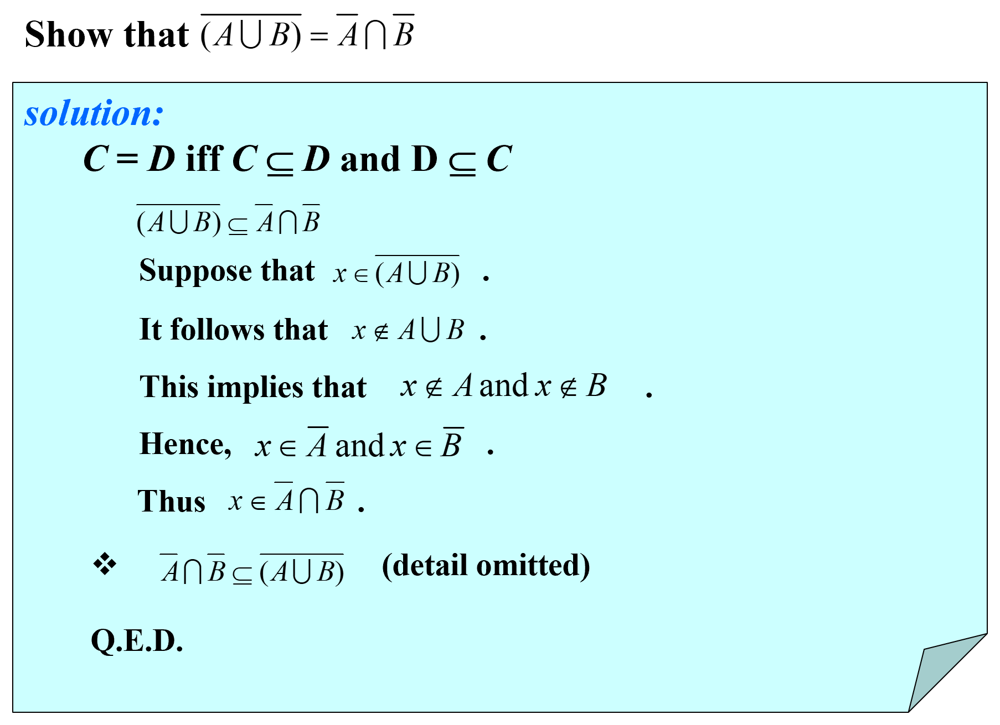
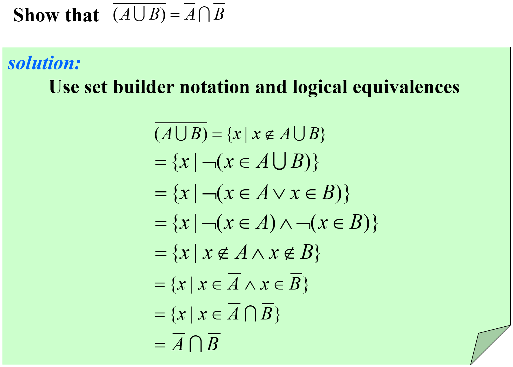
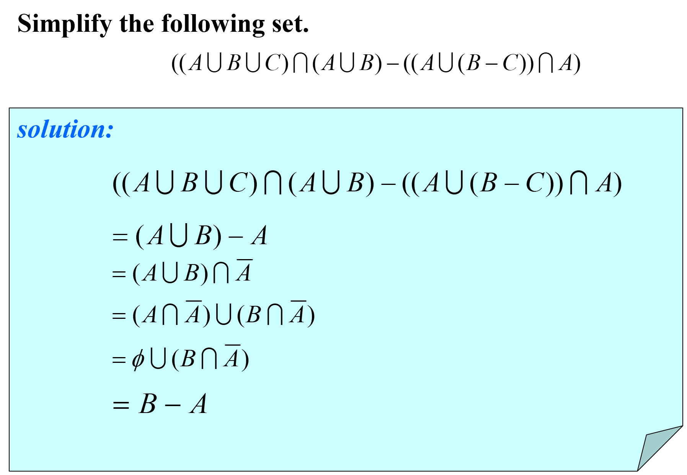
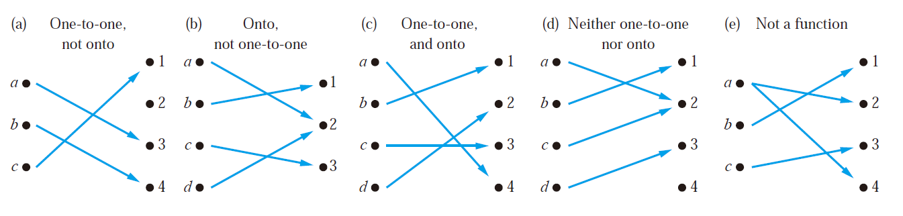

 Chapter 02 Basic Structures 基本结构

# Sets 集合

## Definition 定义

+  A set is an ==**unordered**== collection of **distinct** objects.
+ The objects in a set are called the **elements**（元素）, or **members**（成员）, of the set. 
  + A set is said to contain its elements. 
  + a ∈ A, a is an element of the set A, a$\notin$A, a is not an element of the set A.
>Note:
>+ N = {0,1,2,3,···},the set of all natural numbers 自然数
+ Z = {··· ,−2,−1,0,1,2,···},the set of all integers     整数
+ Z^+^ = {1,2,3,···},the set of all positive integers    正整数
+ Q = {p/q|p ∈ Z,q ∈ Z,q$\ne$ 0}, the set of all rational numbers R, the set of all real numbers.   有理数
+ R^+^, the set of all positive real numbers            实数
+ C, the set of all complex numbers                    复数
>+ ∅, empty set 

## Property 性质
### The  Relations Between Two Sets 集合间的关系

#### Subsets 子集 & Supersets 超集

$$
A\subseteq B, B\supseteq A \Leftrightarrow \forall x(x\in A\to x\in B)
$$

> For every set S
>
> - $$\phi\subseteq S$$
>
> - $$S\subseteq S$$ 

#### Proper subset 真子集

$$
A\subset B\Leftrightarrow\forall x(x\in A\to x\in B)\wedge\exists x(x\in B\wedge x\notin A)\Leftrightarrow(A\subseteq B)\wedge(A\ne B)
$$

#### Equal 相等

$$
A=B \Leftrightarrow \forall x[(x\in A\to x\in B)\wedge(x\in B\to x\in A)]\Leftrightarrow(A\subseteq B)\wedge(B\subseteq A)
$$

> To show that two sets A and B are equal, show that A ⊆ B and B ⊆ A.

### The Size of a Set 集合的大小

+ The number of distinct elements
  + The cardinality of S is denoted by |S|.
  + A set is said to be infinite if it is not finite. (e.g.Z, R)

**Notation**: |S| $\to$  the cardinality of S

e.g. Let A be the set of odd positive integers less than 10. Then |A| = 5.

​	|∅| = 0

### #Power Set 幂集

+ Given a set S, the **power set** of S is the set of all subsets of the set S.
+ e.g $P({0,1,2})=\{\phi,\{0\},\{1\},\{2\},\{0,1\},\{0,2\},\{1,2\},\{0,1,2\}\}$

**Notation**: P(S) $\to$ the power set of S

> Note:
>
> 1. |S|=n implies |P(S)| = $$2^n$$
> 2. S is finite and so is P(S)
> 3. $$x\in P(S)\Rightarrow x\in S（此处x是一个集合）\\x\in S\Rightarrow\{x\}\in P(S)（此处x是一个元素）\\S\in P(S)$$

**Important!!**e.g.

> + What is the power set of the empty set? What is the power set of the set {∅}?
>
> The empty set has exactly one subset, namely, itself. Consequently,P(∅) = {∅}.
>The set {∅} has exactly two subsets, namely, ∅ and the set {∅} itself. Therefore,P({∅}) = {∅, {∅}}.
> 
> ***A good way to check is to make sure |P(S)| = $$2^n$$***

### #Cartesian Products 笛卡尔积

#### Tuple 元组

+ The **ordered n-tuple**（有序n元组） (a1, a2, . . . , an) is the ordered collection that has a1 as its first element, a2 as its second element, . . . , and an as its n-th element.

In particular, **ordered 2-tuples** are called **ordered pairs**（序偶）

> $$(x,y)=(u,v)\Rightarrow(x=u)\wedge(y=u)$$
>
> If $$x\ne y$$, then $$(x,y)\ne(y,x)$$

The Cartesian product of A and B, denoted by A × B, is the set of all ordered pairs (a, b), where a ∈ A and b ∈ B. 

$$
A\times B = \{(a, b) | a\in A\wedge b\in B\}
$$

$$
A_1\times A_2\times· · ·\times A_n = \{(a_1, a_2, . . . , a_n) | a_i\in A_i\ for\ i = 1, 2, . . . , n\}
$$

> **Note**:
>
> If |A|=m, |B|=n, then |A×B|=|B×A|=mn
>
> A×B≠B×A
>
> A×∅ = ∅×A = ∅

# Set Operation 集合运算

## Set Operations 集合运算

### Intersection 交集

$$A\cap B=\{x|x\in A\wedge x\in B\}$$

> Two sets are called *disjoint* if their intersection is the empty set, namely $$A\cap B = \empty$$

#### *Generalized Intersections 拓展的交集

$$A_1\cap A_2\cap...\cap A_n=\bigcap_{i=1}^{n}A_i$$

### Union 并集

$$A\cup B=\{x|x\in A\vee x\in B\}$$

> The cardinality of the union of two finite sets:
>
> $$|A\cup B|=|A|+|B|-|A\cap B|$$

#### Generalized Unions 拓展的并集

$$A_1\cup A_2\cup...\cup A_n=\bigcup_{i=1}^{n}A_i$$

### Difference 差集

$$A-B=\{x|x\in A\wedge x\notin B\}$$

### Complement 补集

$$\overline{A} = {x\in U | x\notin A}$$

(U is the universal set)

> （重要）**Note**:
>
> $$A-B=A\cap\overline{B}$$

### Symmetric Difference 异或

$$A\oplus B=(A\cup B)-(A\cap B)$$

### Disjont 互斥

$$A\cap B=\phi$$

### Principle of inclusion-exclusion 容斥原理

$$|A|\cup|B|=|A|+|B|-|A\cap B|$$

## Set Identities 集合恒等式

|                       Identity 恒等式                        |         Name 名称          |
| :----------------------------------------------------------: | :------------------------: |
|               $$A\cap U = A\\A\cup\empty =A$$                |    Identity laws 恒等率    |
|             $$A\cup U = U\\A\cap\empty=\empty$$              |   Domination laws 支配率   |
|                 $$A\cup A = A\\A\cap A = A$$                 |   Idempotent laws 幂等律   |
|                $$\overline{\overline{A}}=A$$                 |  Complementation law 补率  |
|           $$A\cup B = B\cup A\\A\cap B = B\cap A$$           |  Commutative laws 交换律   |
| $$A\cup (B\cup C) = (A\cup B)\cup C\\A\cap (B\cap C) = (A\cap B)\cap C$$ |  Associative laws 结合律   |
| $$A\cup (B\cap C) = (A\cup B)\cap(A\cup C)\\A\cap (B\cup C) = (A\cap B)\cup(A\cap C)$$ |  Distributive laws 分配律  |
| $$\overline{A\cap B} = \overline{A} ∪ \overline{B}\\\overline{A\cup B} = \overline{A}\cap \overline{B}$$ | De Morgan’s laws 德·摩根率 |
|         $$A\cup (A\cap B) = A\\A\cap (A\cup B) = A$$         |   Absorption laws 吸收率   |
|    $$A\cup \overline{A} = U\\A\cap\overline{A} = \empty$$    |   Complement laws 互补率   |

## Membership Tables 成员表（近似于真值表）

### Ways to Prove Set Identities 集合恒等式的证明方法

#### I. Show that A ⊆ B and that B ⊆ A

> **New and important**

#### II. Use logical equivalences to prove equivalent set definitions

> **Easy but tedious**

#### III. Use a membership table

> **Like truth tables**

#### IV. Use previously proven identities

> **Like ≡**

## Computer Representation of Set 集合的计算机表示

+ Assume that the universal set U is finite.
+ Specify an arbitrary ordering of the elements of U, for instance a~1~, a~2~, ...,a~n~.
+ Represent a subset A of U with the bit string of length n, where the i-th bit in this string is 1 if $a_i\in A$ and is 0 if $a_i\notin A$
+ 说人话就是全集有几个，就有几位，子集的表示就是有的数字为1，没有的数字为0（看例子）

> Thus, **Union -> bitwise OR** **Intersection -> bitwise AND**

> **Example**:
>
> Let *U* ={1, 2, 3, 4, 5,6,7,8,9}, *A*={1, 2, 3, 4, 5}, *B*= (1, 3, 5, 7, 9). 
>
> The bit string for the set *A*: 11 1110 000
>
> The bit string for the set *B*: 10 1010 101

# Functions
## Definitions 定义

Let A and B be **nonempty** sets. A **function** f from A to B is an assignment of **exactly one** element of B to **each element** of A.

We write f (a) = b if b is the unique element of B assigned by the function f to the element a of A.

> 说人话，就是A，B非空，$f:A\to B$的意思就，每个A里的元素通过$f$关系都可以且仅可以得到一个B里的元素

If f is a function from A to B, we write f : A → B.

> A → B is a subset of (A × B) 笛卡尔积

> Functions are sometimes also called **mappings**（**映射**） or **transformations**（**变换**）

$$\forall a(a\in A\to\exists b(b\in B\wedge f(a)=b))$$

- $f:A\to B$，f maps A to B
  - A : **domain**（**定义域**）

  - B : **codomain**（**陪域**）

- $f(a)=b$
  - b : **image**（**像**）
  - a : **preimage**（**原像**）

The **range**（**值域**）, or image, of f is the set of all images of elements of A.

> #陪域大于等于值域
>
> + codomain : the set of all possible values of f;（B中所有值）
> + range: the set of all values of f(a) for $a\in A$,**a subset of the codomain**,(仅仅包含B 中能被A中元素射到的值)

If f is a function from A to B, we say that f **maps**（**映射**） A to B.

###  f1 + f2 and f1f2

> **Two Notations**:
>
> $$(f_1+f_2)(x)=f_1(x)+f_2(x)$$
>
> $$(f_1f_2)(x)=f_1(x)f_2(x)$$

### 并函数和交函数

Let f be a function from A to B and let S be a subset of A. The image of S under the function f is the subset of B that consists of the images of the elements of S. We denote the image of S by f (S), so

$$f(S)=\{f(s)|s\in S\}$$

> $$f(S\cup T)=f(S)\cup f(T)$$
>
> $$f(S\cap T)\subseteq f(S)\cap f(T)$$
>
> **Explaination**:
>
> For the first equivalent, just prove $$f(S+T)\subseteq f(S)+f(T)$$ and $$f(S)+f(T)\subseteq f(S+T)$$ using the method proof by cases
>
> For the second one, itself is easy to prove, but the interesting part is how to give a counterexample to prove that $$f(S)\cap f(T)\subseteq f(S\cap T)$$ is wrong.
>
> This counterexample is that when f() is not one-to-one (this will be mentioned right below), the latter one can be larger than the previous one! (Specific example omitted)

A **monotonic**（**单调**） function f is either **monotonically (strictly) increasing** ($$\forall x\forall y(x<y\to f(x)<f(y))$$) or **monotonically (strictly) decreasing** (($$\forall x\forall y(x<y\to f(x)>f(y))$$))

### Equal Function

+ the same domain
+  the same codomain
+  map each element of their common domain to the same element in their common codomain

###  Image of a subset of A

+ Let f be a function from A to B and let S be a subset of A. 
+ The image of S: $f(S) = \{t|∃s ∈ S(t = f(s))\}$.
  + (the shorthand$ \{f(s)|s ∈ S\}$)

> example
>
> Let $A = \{a,b,c,d,e\}$ and $B = \{1,2,3,4\}$ with $f(a) = 2,f(b) = 1,f(c) = 4,f(d) = 1, and \ f(e) = 1$.
> The image of the subset $S = \{b,c,d\}$ is the set $ f(S) = \{1,4\}$.

## Correspondences 对应关系

### One-to-One Function (Injection)单射函数

A function f is **one-to-one**（**一对一**） (denoted 1-1), or **injective**（**单射函数**）if

​									  $\forall a\forall b(f(a)=f(b)\to a=b)$；								$\forall a\forall b(f(a)\ne f(b)\to a\ne b)$

### Onto Functions/Surjection 满射函数

A function f from A to B is called **onto**（**映上**）, or **surjective**（**满射**） if

$$
\forall b(b\in B)\exists a (a\in A)(f(a)=b)
$$

> In short, **every b in B has a preimage**.

### One-to-one Correspondence Functions (Bijection)双射

The function f is a **one-to-one correspondence**（**一一对应**）, or a **bijection**（**双射**）, if it is **both** one-to-one and onto

> Whenever there is a bijection from A to B, the two sets must have **the same number of elements** or **the same cardinality**.

### Examples of Different Types of Correspondences

> Suppose that f : A → B
>
> - To show that f is injective, show that if f (x) = f (y) for arbitrary x, y ∈ A, x = y.
> - To show that f is not injective, find particular elements x, y ∈ A such that x ≠ y and f (x) = f (y).
> - To show that f is surjective, consider an arbitrary element y ∈ B and find an element x ∈ A such that f (x) = y.
> - To show that f is not surjective Find a particular y ∈ B such that f (x) ≠ y for all x ∈ A.

## Special Functions 特殊函数

### Inverse Functions 反函数

Let f be a **one-to-one correspondence** from the set A to the set B, the **inverse function of f** is denoted by $$f^{-1}$$

$$
f^{-1}(y)=x  \iff f(x)=y
$$

> No inverse function exists unless f is a bijection
>
> Function f is **invertible**（**可逆的**）  iff  f is bijective

### **Compositions of Functions** 复合函数

$$
(f\circ g(a))=f(g(a))
$$

> $f\circ g$ can’t be defined unless the range of g is a subset of the domain of f.

## The Graphs of Functions

+ The **graph**（图） of the function f is the set of ordered pairs $$\{(a,b)|a∈A\wedge f(a)=b\}$$
+ 

## Two Important Functions 两大重要函数

### The floor function 取底函数

The floor function f (x) is the largest integer less than or equal to the real number x

$$\lfloor x\rfloor$$

> The floor function is often also called the greatest integer function. It is often denoted by [x]

### The ceiling function 取顶函数

$$\lceil x\rceil$$

>  哪里有多出来的小边边向哪里取整

# Cardinality of Sets

## Defination

### The Cardinalities of Finite Sets

+ Let S be a set. 
+ If there are exactly n distinct elements in S where n is a nonnegative integer, we say that S is a finite set and that n is the cardinality of S. 
+ The cardinality of S is denoted by |S| .

### Relation between Sets and Mapping 集合与映射的关系

+ The cardinality of a set A is equal to the cardinality of a set B, denoted | A | = | B |, iff **there exists a bijection from A to B**.

+ If **there is an injection from A to B**,  |A| ≤ |B|. 
+ When |A| ≤ |B| and A and B have different cardinality, |A| < |B|.

## 一些不考的内容，见另一个md

# Sequences and Summation

+ A **sequence** is a function from a subset of the set of intergers (usually either the set {0,1,2,…} or the set {1,2,3,…}) to a set S. 

+ We use the notation **$$a_n$$** to denote the image of the image of the integer **n**. 

+ We call $$a_n$$ a term of the sequence $$\{a_n\}$$.

> **The order in a sequence matters!**

## Some Sequences 一些序列

### Geometric Progression 几何级数/等比级数

$$a,ar,ar^2,ar^3,...,ar^n,...$$

### Arithmetic Progression 算术级数

$$a,a+d,a+2d,...,a+nd,...$$

## Recurrence 递推

e.g. Fibonacci Sequence

>  The Fibonacci sequence, f0, f1, f2, · · · , is defined by the initial conditions f0 = 0, f1 = 1, and the recurrence relation
> $$
> f_n = f_{n−1} + f_{n−2}
> $$
> for n = 2,3,4,···.

### ?Solve the Recurrence Relation

 

## *Summations 求和

$$
\begin{equation*}
\sum_{i=m}^na_i=\sum\nolimits_{i=m}^na_i=\sum\nolimits_{m≤i≤n}a_i=a_m+a_{m+1}+...+a_n
\end{equation*}
$$

$$
\sum_{s∈S}f(s)
$$

### Some Useful Summation Formulae 求和公式

$$
\sum_{k=1}^nk^2=\frac{n(n+1)(2n+1)}{6}
$$

$$
\sum_{k=1}^nk^3=\frac{n^2(n+1)^2}{4}
$$

$$
\sum_{k=1}^{\infin}kx^{k-1}=\frac{1}{(1-x)^2},|x|<1
$$

