# Relations and Their Properties
# Relations and Their Properties 关系及关系的性质

## Introductions 引言

### Ordered pair 序偶

> An ordered pair (a, b) is a listing of the objects a and b in a prescribed order.

+ 序偶是关系中基本且重要的一个概念，两个元素组成一个序偶时需要注意有顺序的区分。

### Cartesian roduct 笛卡尔积

> If A and B are two non-empty sets, we define the product set or Cartesian product $A \times B$ as the set of all ordered pairs (a, b) with $a \in A$ and b $\in B$
>
> $A \times B = {(a, b) | a \in A \ and\  b \in B}$

+ 笛卡尔积的概念稍作复习，需要知道笛卡尔积中元素个数为 $N_{A}\times N_{B}$

### Definition of relations 关系的定义

> **Definition 1**:  Let A and B be two sets. A binary relation R from A to B is a subset of $A \times B$.

+ 首先明确从 A 到 B 的二元关系是 A 、B 两个集合笛卡尔积的子集。

>  If $R \subseteq A \times B$ and $(a, b) \in R$, we say that a is related to b by R.
> We use the notation a R b to denote that $(a, b) \in R$ and a $\not{R}$ b to denote that $(a, b) \notin R$, then (a, b) belongs to R, a is said to be related to b by R

+ 接着给出关系的定义，需要明确的是关系是 A 、B 内元素分别参与组成序偶的集合。

> More generally, let A1, A2, ..., An be n sets. An n-ary relation R on these sets is a subset of $A1 \times A2 \times ... \times An$.
>
> The sets $A_i$ are known as the domains of the relation, and n as its degree.

+ 可以推广到 n 元关系，其中每一个集合 $A_i$ 称为关系的域，n 称为关系的度。

### Inverse Relations 逆关系

> Any binary relation R from A to B has an inverse relation $R^{-1}$, defined by $R^{-1} = \{(b, a) | (a, b) \in R \land a \in A \land b \in B\}$.

+ 接下来给出逆关系的定义，只需要把括号内的 a 、b 交换即可得到逆关系。

### **几种特殊的关系**

假设任意非空集合 A ，可以定义集合 A 上的：

- 空关系 $\varnothing$
- 恒等关系 $I_{A} = \{ (a, a)\,|\,\forall a \in A \}$
- 全域关系 $U_{A} = A \times A = \{ (a, b)\, | \, \forall a\forall b (a\in A \land b\in A) \}$

## Properties of Relations

### Reflexive

+ (a, a)
+ $\forall x \in A, \, (x, x)\in R$
  + 一个在集合 A 上的关系具有自反性是说对于集合中的每个元素 a 都与自己有关系 R

### Symmetric

+ (a,b) in and (b, a) in 
+ $\forall x\forall y,\, (x,y)\in R \Rightarrow (y,x)\in R$
  + 关系的对称性是说一个关系的逆关系与这个关系相等，也就是说一旦里面两个元素之间有关系，这两个元素交换序偶得到的关系也符合这个关系

### Antisymmetric

+ (a,b) in but (b, a) not in,  but (a, a) can both be in or not in.
+ $\forall x \forall y,\, (x,y)\in R \land (y,x)\in R \Rightarrow x = y$
  + 关系的反对称性是说，一个集合上的关系，如果有两个元素之间有关系，且逆关系也和原关系相等，这两个元素一定是同一个元素。换句话说，不同的两个元素之间不能原关系和逆关系同时成立，但单个元素可以与自己有关系。

### Transitive

+ a→b, b→c ,so a →c
+ $\forall x\forall y\forall z,\, (x,y)\in R \land (y,z)\in R\Rightarrow (x,z)\in R$
  + 传递性就是如果 a 到 b 有关系 b 到 c 有关系则 a 到 c 也应该有关系，要不然就前件不成立也行。蕴含式前件不成立恒为真。
  + **注意：独立结点、空关系、恒等关系都是传递的**

---

### 重要问题

+ 集合 A 有 n 个元素，有多少个自反关系：

  - 总共有 $n^2$ 个序偶，一共有 $2^{n^{2} }$ 种关系，对角 n 个序偶确定，最后自反关系是$2^{n^{2} -n}$ 种自反关系。

  - 这一类题目要从 0-1 矩阵表示的关系去考虑计数问题

## Combining Relations关系的组合

### 关系运算

+ Let $A =\{1,2,3\}$ and $B = \{1,2,3,4\}$. The relations $R1 = \{(1,1),(2,2),(3,3)\}$ and R2 = $\{(1,1),(1,2),(1,3),(1,4)\}$ can be combined to obtain

  + $R1 ∪ R2 = \{(1,1),(1,2),(1,3),(1,4),(2,2),(3,3)\}$,

  + $R1 ∩ R2 = \{(1, 1)\}$,

  + $R1 − R2 = \{(2, 2), (3, 3)\}$,

  + $R2 − R1 = \{(1,2),(1,3),(1,4)\}$.

  + $R1 ⊕ R2 = R1 ∪ R2 − R1 ∩ R2 = \{(1,2),(1,3),(1,4),(2,2),(3,3)\}$

### 关系合成

+ $S◦R$
  
  > Let R be a relation from a set A to a set B and S a relation from B to a set C. The composite of R and S is the relation consisting of ordered pairs (a, c), where a ∈ A, c ∈ C, and for which there exists an element b ∈ B such that (a, b) ∈ R and (b, c) ∈ S.
  > We denote the composite of R and S by $S◦R$.**（先算R,再算S）**
  
  

### Power of a Relation 关系的幂

+ $R^n$
  + Let R be a relation on the set A. The powers $R^n$, n = 1,2,3,··· , are defined recursively by $R^1 = R$ and $R^{n+1} = R^n ◦ R$.

+ Example
  + Let $R = \{(1,1),(2,1),(3,2),(4,3)\}$. Find the powers $R^n,n=2,3,4,···$ .
  + $R^2 = R ◦ R = \{(1,1),(2,1),(3,1),(4,2)\}$ 
  + $R^3 = R^2 ◦ R =\{(1,1),(2,1),(3,1),(4,1)\}$ 
  + $R^4 = R^3 ◦ R = \{(1,1),(2,1),(3,1),(4,1)\}$
  + $R^n = R^3$
+ ==**THEOREM:** The relation R on a set A is **transitive** if and only if $R^n ⊆ R \ for \ n = 1,2,3,···$. (math induction)==
  + 集合 A 上的关系 R 具有传递性的充要条件是 R 的幂永远是 R 的子集。
+ **拓展特性：将关系的多重幂取并集，本来不具有传递性的关系会变得有传递性**

# n-ary Relations and Their Applications
> **Definition 1** *Let A1, A2,…, An be sets. An n-ary relation on these sets is a subset of A1 × A2 ×⋯× An. The sets A1, A2,…, An are called the **domain**s of the relation, and n is called its **degree.***

- n 元关系是 n 个集合之间的笛卡尔积
- 各集合称为 n元关系的**域**
- n 称为关系的**度**或者叫**阶**

## Relational Databases 关系型数据库

> A *relational database* is essentially just an *n*-ary relation *R*

- 一种基于关系概念构建数据库的方法称为关系型数据库模型

> A domain *Ai* is a ***primary key*** for the database if the relation *R* is functional in *Ai*

- **primary key**，主键：通常选择唯一 n 元组的域作为主键

> A ***composite key*** for the database is a set of domains {*Ai*, *Aj, ...*} such that *R* contains at most 1 *n*-tuple (..., *ai, ..., aj, ...*) for each composite value $(*ai, aj, ...*) \in *Ai × Aj ×⋯*$

- **composite key**，复合主键：当无主键时，可以选多个域的组合为复合主键

## Operations on n-ary Relationsn元关系的运算

### Selection operator 选择

> **Definition 2** *Let R be an n-ary relation and C a condition that elements in R may satisfy. Then the **selection operator** $s_C$ maps the n-ary relation R to the n-ary relation of all n-tuples from R that satisfy the condition C.*

- 选择操作符就是按照热特点条件选出符合的关系
- $s_c$:选出满足条件c的**某一行**

### Projection operator 投影

> **Definition 3** *The projection Pi1i2, …,im where i1 < i2 < ⋯ < im, maps the n-tuple (a1, a2,…, an) to the m-tuple (ai1 , ai2 , …, aim), where m ≤ n.*

- 相当于是一种只看某几列

### Join operator 连接

# Representing Relations 关系的表示

## Representing Relation Using Matrices矩阵

> To represent a binary relation *R*: *A* $\times$ *B* by an $|A| \times |B|$ 0-1 matrix $M_R = [ m_{ij} ]$, let $m_{ij}$ = 1 iff $(a_i, b_j) \in R$.

- 用 0-1 矩阵表示二元关系，1 表示有关系，0 表示没关系
- 用处很大

### properties 判断

#### Reflexive

主对角线元素全为 1 ，其余元素没有要求

#### symmetric

主对角线元素任意，但其他元素需要跟主对角线保持对称，隐含着确定了一半就确定另一半，在计算特定关系数的时候有用

#### antisymmetric

主对角线元素任意，但其他关于主对角线对称的每组元素只有三种情况：0-0、0-1、1-0 ，关系计数有用

### Join and Meet (Boolean Operations of 0-1 Matrices)

#### Join(并)

+ The join of M1 and M2 is denoted by M1 ∨ M2 (for each entry). 

#### Meet(交)

+ The meet of M1 and M2 is denoted by M1 ∧ M2 (for each entry).
  MR1∪R2 = MR1 ∨ MR2 and MR1∩R2 = MR1 ∧ MR2

### The composite of relations

#### composite(布尔积)

(注意⚠️：SoR的意思是R叉乘S，顺序不要错！！)

#### Boolean powers（布尔幂）

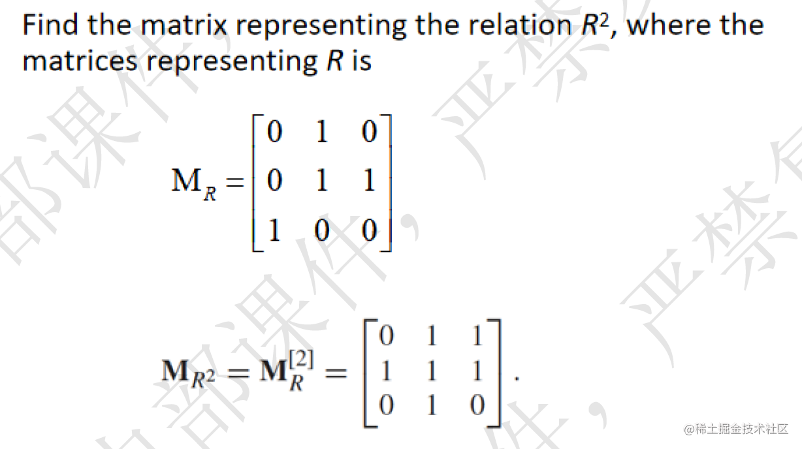

## Representing Relations Using Digraphs

+ A directed graph, or digraph, consists of
  + a set V of vertices (or nodes) together with a set E of ordered pairs of elements of V called edges (or arcs).
       R = {(1, 3), (1, 4), (2, 1), (2, 2), (2, 3), (3, 1), (3, 3), (4, 1), (4, 3)}.
  + 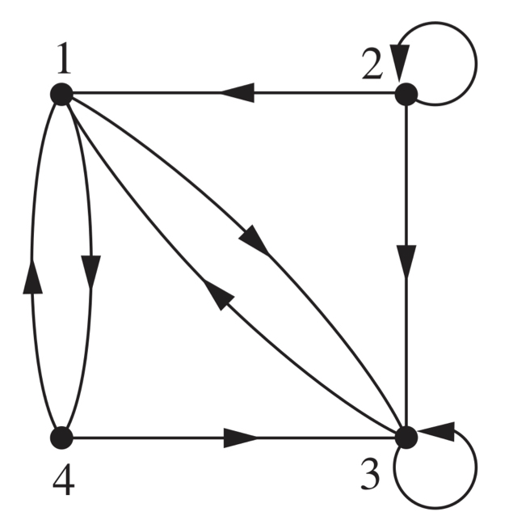
+ 有向图的定义

> The relation R on a set A is represented by the directed graph that has the elements of A as its vertices and the ordered pairs (a, b), where (a, b) ∈ R, as edges.

- 用有向图表示关系，结点是元素，边是序偶

根据图，我们也可以判断关系的性质

1. **Reflexive:** there is **a loop** at every vertex.
   + 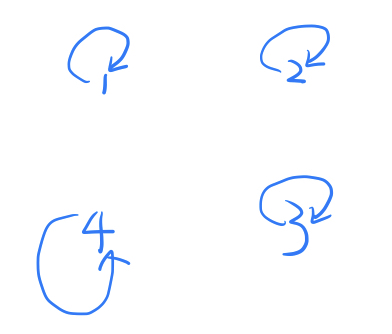

2. **Symmetric:** for every edge between distinct vertices in its digraph there is an edge in the opposite direction. 
   + 对称性：每两个结点间如果有连接则一定是双向的，要么就没有连
   + 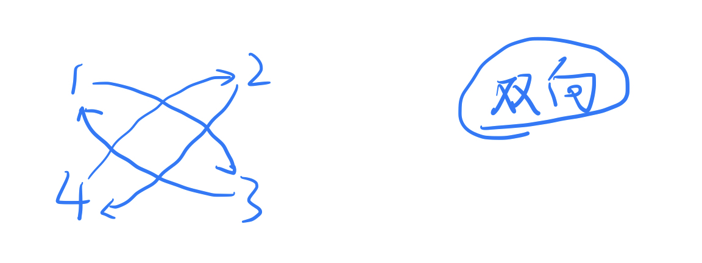
3. **Antisymmetric:** there are never two edges in opposite directions between distinct vertices.
   + 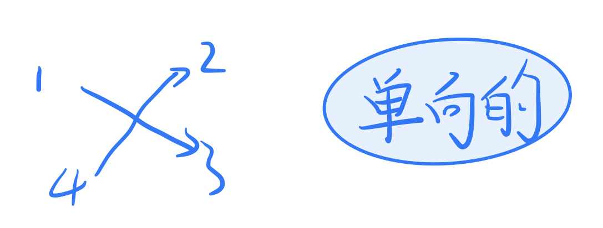

4. **Transitive:** whenever there is an edge from a vertex x to a vertex y and an edge from a vertex y to a vertex z, there is an edge from x to z.
   + 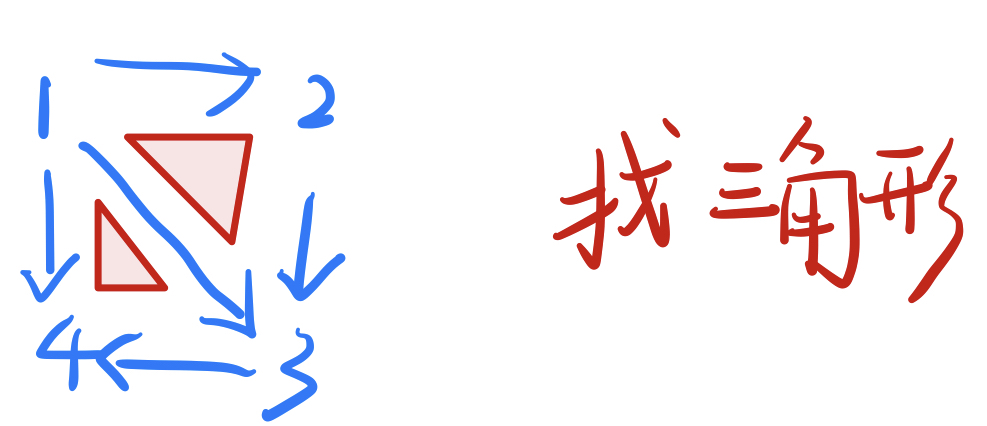

# 小结

|   关系特征    |                          关系图特征                          |              关系矩阵特征              |
| :-----------: | :----------------------------------------------------------: | :------------------------------------: |
|   Reflexive   |                     每一结点处都有一个环                     |            对角线元素均为1             |
|   Symmetric   |                 两结点间有相反的两边同时出现                 |             矩阵为对称矩阵             |
| Antisymmetric |              两结点间**没有**相反的两边同时出现              | 矩阵为反对称矩阵（分量cij=1时，cji=0） |
|  Transitive   | 如果结点v1,v2间有边，v2，v3间有边，那么v1，v3间必有边，**（数三角形）** |           $R^n\subseteq R $            |

# Closures of Relations (闭包)

1. if R is a relation on a set A
2. it may or may not have some property P,such as reflexivity,symmetry, or transitivity.
3. when R does not enjoy property P, we would like to find the smallest relation S on A with property P that contains R（如果存在包含R的具有性质P的关系S，并且S是所有包含R且具有性质P的关系的子集，那么S叫做R的关于性质P的闭包）

即：

> **Definition 1** *If R is a relation on a set A, then the closure of R with respect to P, if it exists, is the relation S on A with property P that contains R and is a subset of every subset of A × A containing R with property P.*

+ 闭包三要素：

  - 闭包包含 R

  - 闭包具有性质 P

  - 闭包是具有上述 2 点的所有关系中**最小的**

+ If there is a relation S that is a subset of every relation containing R with property P, it must be unique.

## Reflexive Closures(自反闭包）

+ the reflexive closure of R equals $R ∪ ∆$ ,
  + $∆ = \{(a, a) | a ∈ A\}$ **(Diagonal relation对角关系 on A).**
    + eg： What is the reflexive closure of the relation $R = \{(a, b) | a < b\}$ on the set of integers.
    + sl: $R∪∆ = \{(a,b)|a < b\}∪\{(a,a)|a ∈ Z\} = \{(a,b)|a ≤ b\}$
+ 定理 1 ：设 R 是 A 上的二元关系，则 r(R) 是包含 R 且具有自反性的最小关系
+ 推论 1 ：R 是自反闭包当且仅当 R 是自反的

## Symmetric Closures

+ The symmetric closure of a relation can be constructed by taking the union of a relation with its inverse, $R ∪ R^{−1}$ , $R^{−1} = \{(b,a)|(a,b) ∈ R\}$.（注意：范围是(a,b) )

+ **! 不存在反对称闭包**
+ 定理 2 ：设 R 是 A 上的二元关系，则 $R ∪ R^{−1}$ 是对称的，包含 R 的最小关系
+ 推论 2 ：R 是对称闭包当且仅当 R 是对称的
  - 求自反闭包只需要把 R 并上单位矩阵即可（加自环）
  - 求对称闭包只需要把 R 并上其逆关系即可

## Transitive Closures

### Path in Directed Graphs

> **Definition 2** 
>
> + A path from a to b in the directed graph G is a sequence of edges $(x0,x1),(x1,x2),(x2,x3),··· ,(xn−1,xn)$ in G. (a = x0,b = xn)
> + This path is denoted by x0,x1,x2,··· ,xn−1,xn and has **length n**.
> + **The empty set of edges**: a path of length zero from a to a.
> + **A circuit or cycle**: a path of length n ≥ 1 that begins and ends at the same vertex.
>   简而言之，就是如果某几个点能首尾相连，即有一条通路 length是边的长度，一条边为1.

### Transitive Closures

#### **Connectivity Relation（连通性关系）**

+ 路径由单向边相连的结点构成

> **Theorem 1** *Let R be a relation on a set A. There is a path of length n, where n is a positive integer, from a to b if and only if (a, b) ∈ Rn.*

定理：设 a 到 b 有长度为 n 的路径，n 为正整数，当且仅当 (a, b) ∈ Rn

> **Definition 3** Let R be a relation on a set A. The connectivity relation R\* consists of the pairs (a, b) such that there is a path of length at least one from a to b in R.

> **Thereom 2** *Let R be a relation on a set A. The connectivity relation R\* consists of the pairs (a, b) such that there is a path of length at least one from a to b in R.

$R^{*} = t(R) = R\cup R^{2} \cup R^{3} \cup ... = \bigcup\limits_{i=1}^{\infty}R^{i}$

事实上计算有限集合 A 的传递闭包并不需要求无穷次并运算，最后会成为循环

> **Lama 1** *Let A be a set with n elements, and let R be a relation on A. If there is a path of length at least one in R from a to b, then there is such a path with length not exceeding n. Moreover, when a ≠ b, if there is a path of length at least one in R from a to b, then there is such a path with length not exceeding n − 1.*

> **Theorem 3** *LetMR be the zero–one matrix of the relation R on a set with n elements. Then the zero–one matrix of the transitive closure R∗ is MR∗ = MR ∨M[2] R ∨M[3] R ∨⋯∨M[n] R .*

$$t(R) = R\cup R^{2}\cup R^{3}\cup ...\cup R^{n}$$

+ （设R是集合A上的关系。连通性关系R*由形如(a,b)的有序对构成，使得在关系R中，从a到b之间存在一条长度至少为1的路径。
  所以，R*是所有Rn的并集：

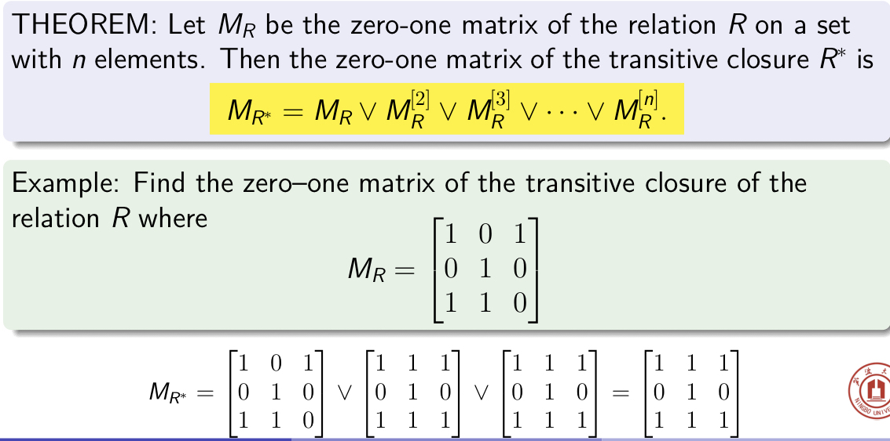

+ 定理：设 $R\subseteq A\times A$ 且 $A \neq \varnothing$ 则

  - R 自反 等价于 r(R) = R

  - R 对称 等价于 s(R) = R

  - R 传递 等价于 t(R) = R

+ 定理：设 $R_{1}\subseteq R_{2}\subseteq A\times A$且 $A \neq \varnothing$ 则

  - $r(R_{1})\subseteq r(R_{2})$

  - $s(R_{1})\subseteq s(R_{2})$

  - $t(R_{1})\subseteq t(R_{2})$

#### Warshall’s Algorithm

W0 原图
W1 借助于a点（第一个点，可以到达哪些边）
…
W~n~ 借助于n点（第n个点——最后一个点，可以到达哪些边）
其中，Wn就是传递闭包

# Equivalence Relations

## Equivalence Relations

A relation on a set A is called an equivalence relation  if it is reflexive, symmetric, and transitive.
(a,b) ∈ R or aRb, a and b are equivalent, denoted as a ∼ b.

+ 定义：R 是 A 上的二元关系，如果 R 是

  - 自反的

  - 对称的

  - 传递的

则称 R 为等价关系。$(a,b)∈R$ 称 a 与 b 等价

+ 完全关系（全域关系）：
  + 每个结点都有自环，且两两之间有双向边

## Equivalence Classes

#### Equivalence Classes 等价类

$$[a]_{R} = \{b|b\in A \land aRb\}$$

+ If b ∈ [a], then b is called a **representative 代表元** of this equivalence class
  + 定义：设R是定义在集合A上的等价关系。与A中的一个元素a有关系的所有元素的集合叫做a的等价类。
+ The equivalence class of a with respect to R is denoted by [a]R .
  + 当只考虑一个关系时，可以省略下标，写作[a]
  + 例如同余关系。
  + 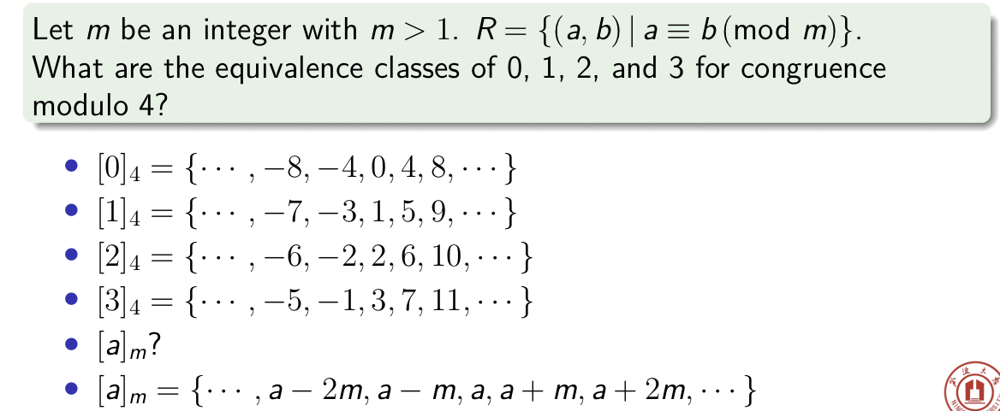

**如何根据等价类关系图求等价类：**

- 每个独立子图上的结点构成一个等价类
- 独立子图个数 = 不同等价类个数

**等价类性质：**

- 同一个等价类中的元素，彼此有等价关系
- 同一关系的两个不同等价类交集为空
- 两个等价类相等，当且仅当他们的代表元有等价关系
- 等价关系的所有等价类构成的集合是原集合的一个**划分**

#### Parition 划分

+ 集合的划分：

  - 若干子集非空（划分里不能有空集）

  - 两个子集交集为空

  - 所有子集并集为原集合

+ 平凡划分：

  - 最粗的划分（只有一个子集）

  - 最细的划分（每个元素都构成一个子集）

**可以通过划分 P 确定一个集合的等价关系**

**可以通过等价关系确定划分 P**

**##Eg.**

 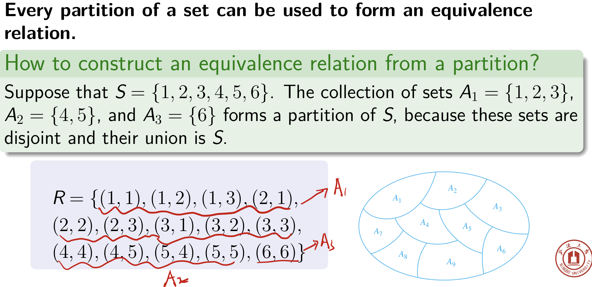

# Key Knowledge Points

## equivalence relation

+ a 
  + reflexive, 
  + symmetric, 
  + and transitive 
+ relation; 

## equivalent

+ if R is an equivalence relation, a is equivalent to b 
  + $(a ∼ b)$ if $aRb$

## [a]R (equivalence class of a with respect to R)

+ the set of all elements of A that are equivalent to a;

## partition of a set S

+ a collection of pairwise(成对) disjoint nonempty subsets that have S as their union.

  +  以 S 作为并集的成对不相交的非空子集的集合。

---

# Patrial Order 偏序关系

## Partical Order

> A relation R on a set A is called a *partial order* if R is reflexive, antisymmetric, and transitive.

如果一个关系满足：

- Reflexive 自反性
- Antisymmetric 反对称性
- Transitive 传递性

则这个关系称为**偏序关系**（Partical Order）

> A set S together with the partial order R is called a *partially ordered set*, or simply a *poset*, and we will denote this poset by (S, R)

## Poset

偏序关系和其集合共同构成**偏序集** **（poset）**，记为 $(S, R)$

例如 $(Z^{+},\leqslant)\quad (Z^{+},\geqslant)\quad (Z^{+},|)\quad,(S,\subseteq)$

+ $(Z^{+}, <)$s not a poset, because it's irreflexive.

## Comparability 可比性

> If $(A,\preccurlyeq)$ is a poset, the elements *a* and *b* are said to be
>
> - *comparable* if $a\preccurlyeq b$ or $b \preccurlyeq a$
> - *incomparable* if neither $a \preccurlyeq b$ nor $b \preccurlyeq a$

+ 两个元素间存在偏序关系则称两个元素可比（comparable），不存在偏序关系则称不可比（incomparable）

## Linear order 线序关系（全序关系）

+ If $(S, ≼)$ is a poset and every two elements of S are comparable, 
  + S is called a **totally ordered** or **linearly ordered** set, 
  + and $≼$ is called a total order or a linear order.
+ A totally ordered set is also called a **chain.**

线序关系满足：

- 集合内两两元素都**可比**

线序关系用哈斯图表示出来是一条**链**

例如：

- $(Z^+,⩽)$ 任何两个元素都是可比的，是链
- $(Z^+,∣)$ 有些元素不可比，不是链

## Well-ordered set 良序

> $(S,\preccurlyeq)$ is a *well-ordered set* if it is a poset such that $\preccurlyeq$ is a *total ordering* and every nonempty subset of $S$ has at least element.

+ 每一个非空集合都能找到**最小元素**的全序集称为**良序集**（well-ordered set）

推论：

- 有限关系集合的全序集一定是良序集
- 无限关系集合的全序集不一定是良序集

例如：

- $(Z^{+},\leqslant)$ 是良序集，任何子集总能找到最小元
- $(Z,<)$不是良序集，因为 $Z$ 的负整数子集没有最小元

## Lexicographic Order 字典序

+ Two posets, $(A_1, ≼_1)$ and $(A_2, ≼_2)$;
+ The lexicographic ordering $≼$ on $A_1 × A_2$
  + $(a_1,a_2)≺(b_1,b_2)$: either if $a_1 ≺_1 b_1$ or if both $a_1 =b_1$ and $a_2 ≺_2 b_2$. 
  + $(a_1,a_2)=(b_1,b_2)$.

词典顺序：首先比较第一元素，依次比较第二元素，以此类推，n的不写了，差不多的。

+ The definition of lexicographic ordering is that the string $a_1a_2 · · · a_m$ is less than $b_1b_2 ···b_n$ if and only if (let t be the minimum of m and n)
  + $(a_1,a_2,··· ,a_t) ≺ (b_1,b_2,··· ,b_t)$, or
  + $(a_1,a_2,··· ,a_t) = (b_1,b_2,··· ,b_t)$ and m < n.
+ eg
  + discreet ≺ discrete; 
  + discreet ≺ discreetness;
  + discrete ≺ discretion.

# Hasse Diagrams哈斯图

## Hasse Diagrams 哈斯图的构造

> Hasse Diagrams is the diagraph of a partial order on a finite set A that
>
> - deletes all self-cycles
> - eliminates all edges that are implied by the transitive property
> - draws the diagraph with all edges pointing upward

哈斯图以简洁的方式表示出偏序集中元素之间的关系。

从有向图表示的偏序关系改为哈斯图分三步：

- 删除自环
- 取消传递性而来的边
- 边方向向上

## Covering Relation

+ Let$(S,≼)$be a poset.
+ We say that **an element** $y∈S$ covers an element $x∈S$ if $x≺y$ and there is no element $z ∈ S$ such that $x ≺ z ≺ y$.
+ The set of pairs $(x, y)$ such that y covers x is called the covering relation of $(S, ≼)$
+ **The poset is the reflexive transitive closure of its covering relation.**

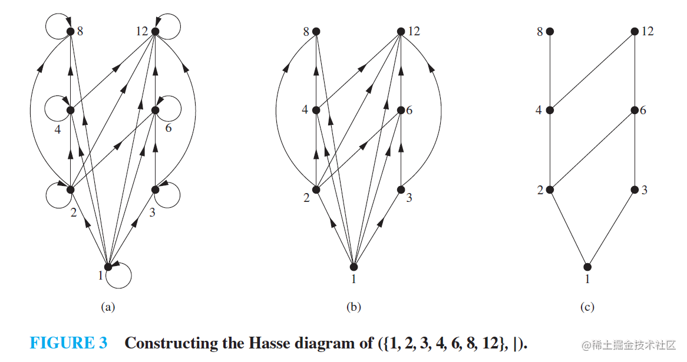

### 偏序集的重要元素

#### Maximal(miminal) element 极大（极小）元

> + "Top"
>   + An element $a \in A$ is called a **maximal element** of $A$ if there is no element $c$ in $A$ such that $a < c$.
>
> + "Bottom"
>   + An element $b \in A$ is called $a$ **minimal element** of $A$ if there is no element $c$ in $A$ such that $c < b$.

- 极大元就是比选定子集**任何一个**元素都要靠后的元素，**只能在子集内中找**
- 极小元就是比选定子集**任何一个**元素都要靠前的元素，**只能在子集内中找**

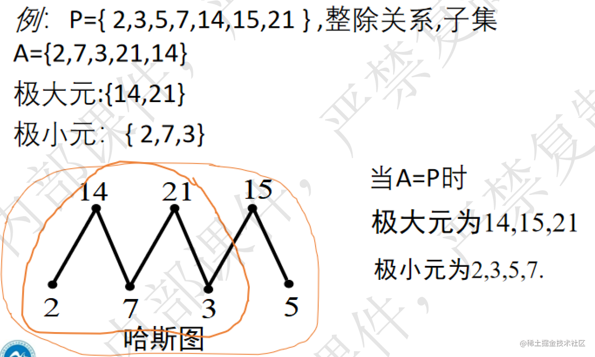

**注意：极大极小元并不唯一，且同一元素既可能是极大元，又可能是极小元**

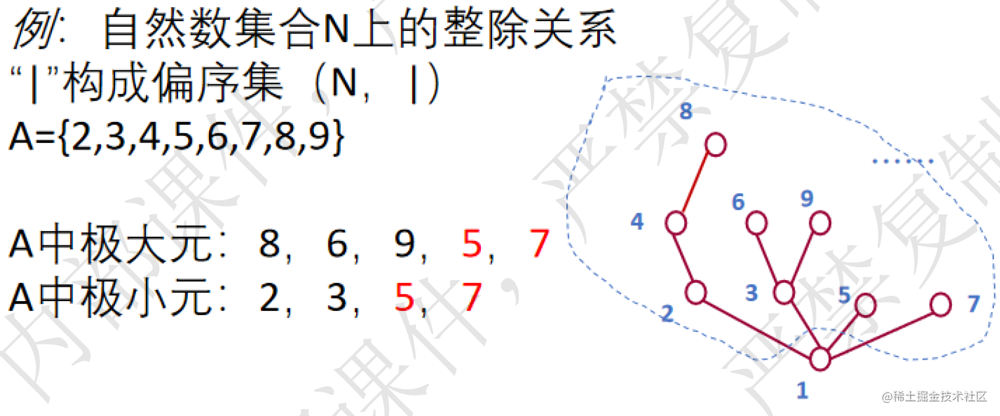

#### Greatest (least) element 最大元（最小元）

定义：偏序集 $(P,\preccurlyeq)$ 中，子集 $A\subseteq P$A ，

- 若 $a\in A$ ，对 $\forall b\in$ 都有 $b\leqslant a$ 则 $a$ 为 $A$ 的最大元
- 若 $a\in A$ ，对 $\forall b\in A$ 都有 $a\leqslant b$ 则 $a$ 为 $A$ 的最小元

**注意：最大元和最小元都在子集 A 中找。**

**子集 A 的最大元或最小元如果存在，则与 A 中的任意元素必须可比**

有时候最大最小元可能不存在

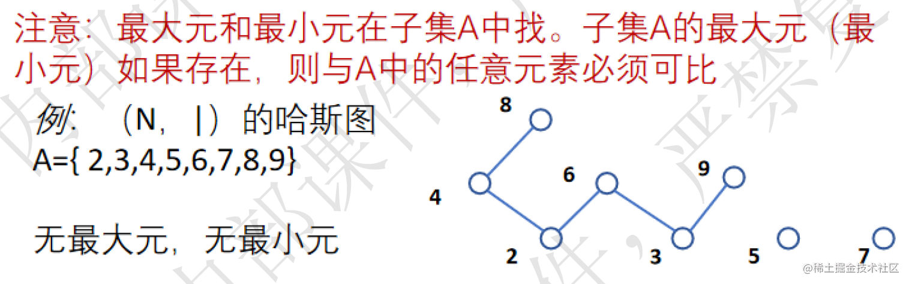

如果 A 是全集，则

- 最大元通常用 1 表示，称为单位元
- 最小元通常用 0 表示，称为零元

####  Lower and Upper Bound

+ A subset $A$ of a poset $(S,≼)$.

  + If $u∈S$ such that $a≼u$ for all elements $a∈A$, then $u$ is called an **upper bound** of A.
  + If $l∈S$ such that $l≼a$ for all elements $a∈A$, then $l$ is called a **lower bound** of $A$.

  

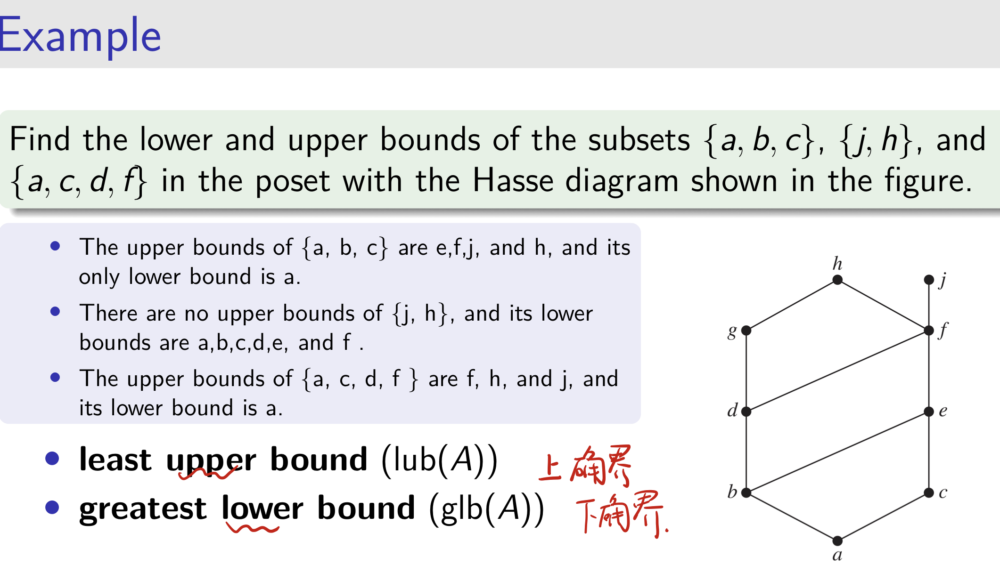

#### lub 最小上界 glb 最大下界

+ 子集 B 的最小上界（least upper bound）就是比 B 任何一个元素都要靠后的第一个元素，是**在全集中找**，有可能在子集内也可能在子集外
+ 子集 B 的最大下界（greatest lower bound）就是比 B 任何一个元素都要靠前的第一个元素，是**在全集中找**，有可能在子集内也可能在子集外

### 总结

- 有限非空集合极大元、极小元各至少一个
- 最大元、最小元各最多一个
- 子集的最小上界、最大下界各最多一个

## 拓扑排序

### Topological Sorting 拓扑排序

> A total ordering $\preccurlyeq$ is said to be **compatible** with the partial ordering R if $a \preccurlyeq b$ whenever aRb.
>
> Constructing a compatible total ordering from a partial /ordering is called **topological sorting**.

看例子就行

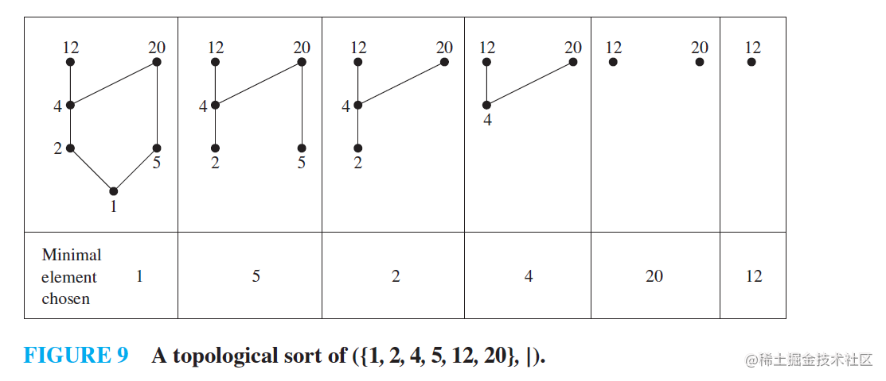

$$1 ≺ 5 ≺ 2 ≺ 4 ≺ 20 ≺ 12$$

---

# *格(不考)

## Lattices 格的定义

> A *lattice* is a poset in which every subset $\{a, b\}$ consisting of two elements has a least upper bound (l.u.b) and a greatesr lower bound (g.l.b)
>
> denote **l.u.b({a, b})** by $a\lor b$ and call it the *join* of a and b
>
> denote **g.l.b({a, b})** by $a\land b$ and call it the *meet* of a and b

- **格**是**任意两个元素**构成的子集都有小上界和最大下界的偏序集
- 用并表示两个元素构成子集的 l.u.b(开口向上) ，用交表示两个元素构成子集的 g.l.b（开口向下）

**定理：两个格的氏积也是一个格**

子格（sublattice）类比子集的定义

## Properties of lattices 格的性质

格是特殊的偏序，所以格具有偏序的所有性质

**特性：格的 l.u.b 和 g.l.b 都是唯一的**

---

# 总结

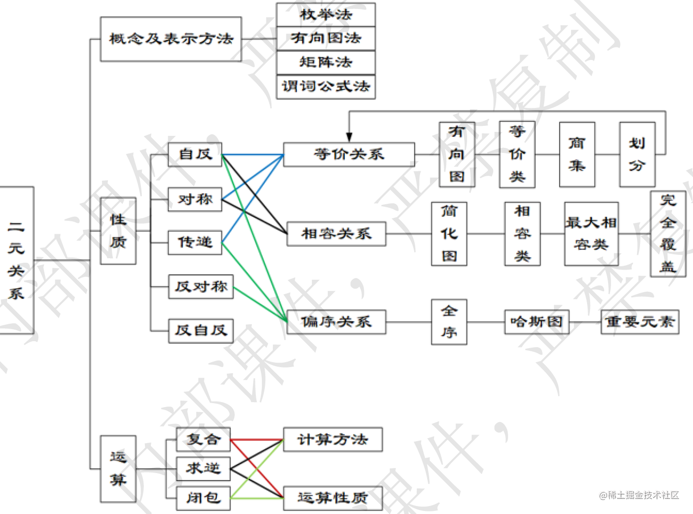

+ If a relation is both an equivalence and a poset, then 它只有对角线有元素。 