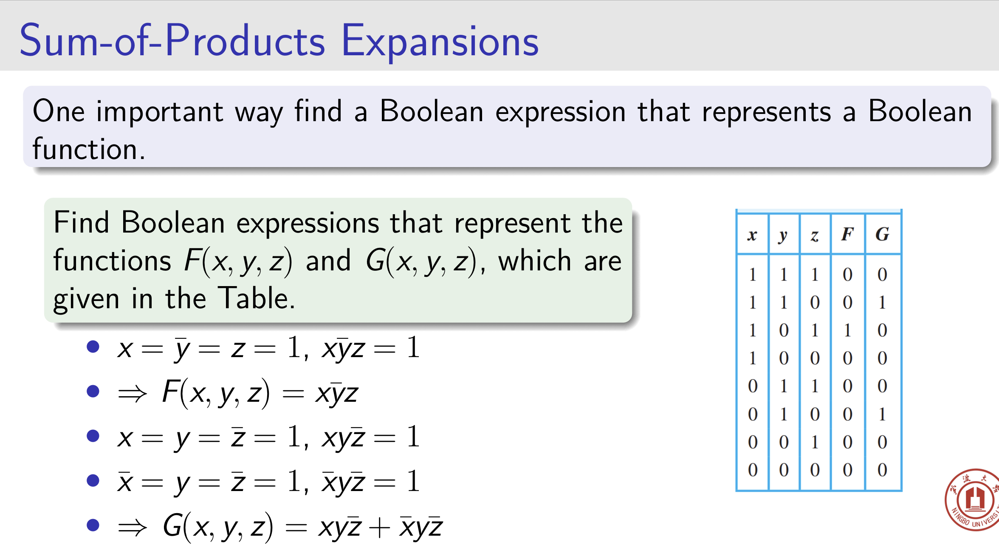
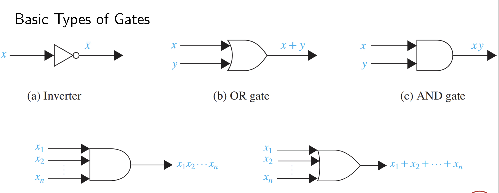
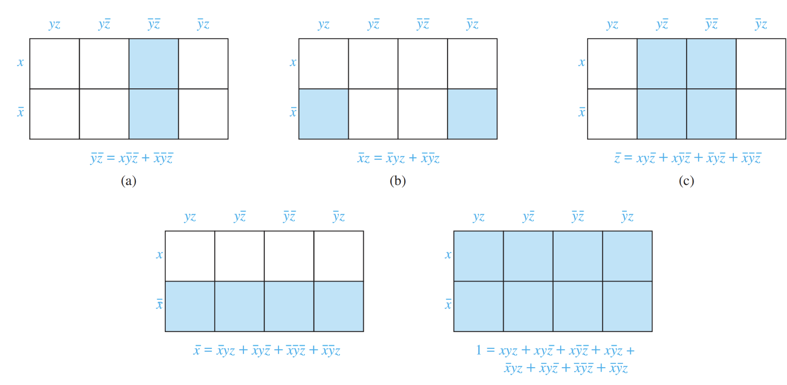

# Boolean Function

## Transtlate

+ Translate $1 · 0 + (0 + 1) = 0$ into a logical equivalence. 
  + $(T∧F)∨¬(T∨F) ≡ F$

## Duality 对偶式

+ The dual of a Boolean expression is obtained by interchanging Boolean sums and Boolean products and interchanging 0s and 1s.
  + 即，把sum和product互换，把0和1互换，其他不变。
  + 这个和数字电路里的一样，但是数字电路还有一个反演规则(Complementary)，再加一个要求——把原变量换成反变量，反变量变成原变量

## Sum-of-Products Expansions字面值的乘积 即与或式

### Minterm最小项（同数电）

## Dual: Product-of-Sums Expansion*（或与式）

### Maxterm最大项（同数电）

## Functional Completeness函数完备性

+ **满足条件**：Every Boolean function can be represented using the Boolean operators $·,+, ̄$
  + We say that the set {·,+, ̄} is functionally complete.
  + Can we find a smaller set of functionally complete operators?
    + eliminate sum: $x + y = \overline{\bar x\bar y}$
    + eliminate product: $xy = \overline{\bar x + \bar y}$
  + A set containing just one operator?
    + $|$ or $NAND$ , $\bar x = x|x, xy = (x|y)|(x|y) $
      + 1|1 = 0, 1|0 = 0|1 = 0|0 = 1
    + $↓$ or $NOR$ , $\bar x = x ↓ x$, $xy = (x ↓ x) ↓ (y ↓ y)$

# Logic Gates

# Minimization of Circuits

## Karnaugh Maps (K-map) 卡诺图

同数字电路，不说了

**相邻项只能有一个字母相反**

## The Quine–MCCluskey Method

