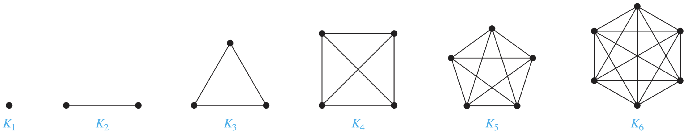

# Graphs and Graph Models
## Graphs
### $G = (V,E)$  

+ $G = (V,E)$  

  + V vertices 顶点(or nodes 结点) **顶点集必须为非空**

  + E edges 边

  + **endpoints**: 端点 有边与之相连的点称为端点。

  + finite graph：有限图 (V,E为有限集)

  + infinite graph：无限图

### simple graph

+ A graph in which each edge connects two different vertices and where no two edges connect the same pair of vertices is called a simple graph(两点之间有且仅有一条边连接) 
  + {u,v} is an edge of the graph

### 图术语

|         Type          |   Edges    | Multiple Edges Allowed? | Loops Allowed? |
| :-------------------: | :--------: | :---------------------: | :------------: |
|     Simple graph      | Undirected |           NO            |       NO       |
|      Multigraph       | Undirected |           Yes           |       No       |
|   Pseudograph(伪图)   | Undirected |           Yes           |      Yes       |
| Simple directed graph |  Directed  |           No            |       NO       |
|  Directed multigraph  |  Directed  |           Yes           |    **Yes**     |
|      Mixed graph      |  Directed  |           Yes           |      Yes       |

# Graph Terminology（图术语）
1. **Adjacent**(临接/相邻)： Two vertices u and v in an undirected graph G are called adjacent(or neighbors) in G.
2. **Incident**(关联)： if u and v are endpoints of an edge e of G， such an edge e is called incident with the vertices u and v, and e is said to connect u and v
+ 说人话，就是 如果点u点v由一条边e相连，这**两点**称为**Adjacent** ,这**边**称为**Incident**
3. #**degree**(度): The degree of a vertex in an **undirected graph** is the number of edges incident with it.
	
	+ **a loop contributes 2 degree**
4. **Isolated**(孤立的)：没有度的点
5. **Pendant**（悬挂的）：度为1的点
6. **The Handshaking Theorem**
   $$
   2m=\sum_{v\in V}{deg(v)}
   $$
   
7. **无向图有偶数个度为奇数的顶点** 
8. 在有向图中：
	+ $(u,v)$ v 从 u 临接 v is adjacent from u
	+ u is called the **initial vertex**（入边）
	+ v is called the **terminal or end vertex**（出边）
	+ **in-degree**（入度）
	$$
	deg^{-}(v)
	$$
	+ **out-degree**(出度)
	$$
	deg^{+}(v)
	$$
	+ **a loop 对某点出入度都贡献为1**
	
	  + $$
	    \sum_{v \in V}{deg^{-}(v))}=\sum_{v \in V}{deg^{+}(v)} =|E|
	    $$

# Special Types of Graph
### **Complete Graphs(K~n~)**			完全图

### **Cycles(C~n~)	**		圈图(n≥3)

### **Wheels(W~n~)	**		轮图(n≥3)

4. **n-Cubes(Q~n~)**			n立方体图 2^n

# Bipartite Graphs			二分图

（当且仅当能够对图中的每个顶点赋予两种不同的颜色。并且没有两个相邻的顶点被赋为相同的颜色）

## **Complete Bipartite Graphs**($K_{m,n}$)

+  A **complete bipartite graph** Km,n is a graph that has its vertex set partitioned into **two subsets** of m and n vertices, respectively with an edge between two vertices if and only if one vertex is in the first subset and the other vertex is in the second subset.

+ 看例子

## Bipartite Graph and Matching
### **A matching M**

> a subset of the set E of edges of the graph such that no two edges are incident with the same vertex.

+ 一个没有两条边关联相同的顶点的子集
  + 即，如果$\{s, t\}, \{u, v\}$是匹配中的不同边，那么s, t, u, v是不同的顶点。

### Be matched or unmatched

> A vertex that is the endpoint of an edge of a matching M is said to be **matched** in M; otherwise it is said to be **unmatched**.

+ 若一个顶点是匹配M中的一条边的端点，则称该顶点在M中被匹配，反之，未被匹配。

### maximum matching

> A **maximum matching** is a matching with the largest number of edges.

+ 包含最多边数的一个匹配称为最大匹配

### complete matching

> A matching M in a bipartite graph $G = (V, E)$ with bipartition $(V_1, V_2)$ is a complete matching from $V_1$ to $V_2$ if every vertex in $V_1$ is the endpoint of an edge in the matching, or equivalently, if $|M| = |V_1|$.

+ 即，每个人都能被匹配到

### #**HALL'S MARROAGE THEOREM**

+ 当且仅当对于$V_1$的所有子集$A$，有$|N(A)| ≥ |A|$（在V~2~中与V~1~的顶点相邻的顶点个数至少与V~1~中的顶点个数一样多）时，带有二部划分$(V_1,V_2)$的二分图$G=(V,E)$中有一个从$V_1$到$V_2$的完全匹配

# New Graphs from Old
## Subgraph
+ 子图
A subgraph of a graph G = (V, E) is a graph H = (W, F), where W ⊆ V and F ⊆ E.
+ 真子图
A subgraph H of G is **a proper subgraph** of G if H ̸= G.

+ Let G = (V, E) be a simple graph. The **subgraph induced** by a subset W of the vertex set V is the graph (W, F), where the edge set F contains an edge in E if and only if both endpoints of this edge are in W.（令G=(V,E)是一个简单图，图 (W, F)是由顶点集V的子集W**导出的子图**，其中边集F包含E中的一条边当且仅当这条边的两个端点都在W中）

## New Graphs from Old
### Removing or Adding Edges of A Graph

+ $G−e=(V,E−\{e\})$
+ $G+e=(V,E∪\{e\})$

### Edge Contractions (边的收缩)

+ 有时，当我们从图中删除一条边后，我们不希望将该边的端点作为独立的顶点保留在所得到的子图中。在这种情况下，我们进行边的收缩，删除端点为$u$和$v$的边$e$，把$u$和$v$合并成一个新的顶点$w$，对每一条以$u$或$v$为端点的边，将该边$u$或$v$的位置替换成$w$且另一个端点不变。

### **Removing Vertices from a Graph**

+ 当我们从图 $G=(V, E)$删除一个项点口以及所有与它相关联的边时，就得到图$G$的一个子图，记作$G-V$。

  + 注意，$G-U=(V-v，E')$，其中$E'$是$G$中不与$v$相关联的边的集合。
  + 类似地，若$V'$是$V$的子集，则图$G-V'$是子图$(V-V'，E)$，其中$E'$是$G$中不与$V'$中的顶点相关联的边的集合。

+ eg.
  + 

### Graph Unions(图的并集)

+ The **union** of two simple graphs $G_1 = (V_1, E_1)$ and $G_2 = (V_2, E_2)$ is the simple graph with vertex set $V_1 ∪ V_2$ and edge set $E_1 ∪ E_2$.
+ The union of $G_1$ and $G_2$ is denoted by $G_1 ∪ G_2$.

# Representing Graphs
## Adjacent lists(邻接表)点点关系

+ represent a graph with no multiple edges.

## Adjacent Matrices（邻接矩阵）点点关系

$$
a_{ij}=
\begin{equation}
\left\{
	\begin{array}{lr}
	1	& \quad if\quad\{v_i,v_j\}\quad is\quad an\quad edge\quad of \quad G,\\
	0	& otherwise.
	\end{array}
\right.
\end{equation}
$$

+ **sparse(few edges)**(稀疏图)：包含的边相对较少。用adjaceny lists or sparse matrix 
+ **dense(many edges)**(稠密图)：包含的边相对较多，用adjacency matrices

## Incidence Matrices （关联矩阵）点边关系

$$
a_{ij}=
\begin{equation}
\left\{
	\begin{array}{lr}
	1	& \quad when\quad edge\quad e_j\quad is \quad incident \quad with\quad v_i,\\
	0	& otherwise.
	\end{array}
\right.
\end{equation}
$$

# Graph Isomorphism
## Isomorphism of Graphs(图的同构)

+ 设$G_1=(V_1，E_1)$和$G_2=(V_2，E_2)$是**简单图**，若存在**一对一**的和映上的从$V_1$到$V_2$的函数f，且$f$具有这样的性质：对$V_1$中所有的$a$和$b$来说，$a$和$b$在$G_1$中相邻当且仅当$f(a)$和$f(b)$在$G_2$中相邻，则称$G_1$和$G_2$是同构的。这样的函数$f$称为同构（**isomorphism**）。两个不同构的简单图称为不同构的（**nonisomorphic**）
+ 

## Determining whether Two Simple Graphs are Isomorphic

+ 画矩阵，通过行列初等变化能一样就可以。即Ai=Aj，两个矩阵相等

# Connectivity

## Paths通路

+ 设$n$是非负整数且$G$是**无向图**。在$G$中从$u$到$v$的长度为$n$的通路是$G$的$n$条边$e_1,...，e_n$的序列，其中存在$x_0=u,x_1,...,x_n=v$的顶点序列，使得对于$i=1,...,n$, $e_i$以$x_{i-1}$和$x_i$做为端点。当这个图是简单图时，**就用顶点序列$x_0,x_1,...,x_n$, 表示这条通路**(因为列出这些顶点就唯一地确定了通路)。若一条通路在相同的顶点开始和结束，即么一旦长度大于0，则它是一条回路。把通路或回路说成是经过顶点$x_1,x_2，x_{n-1}$或遍历边$e_1,e_2,e_n$。若通路或回路不重复地包含相同的边，则它是简单的。

> 即，通路path是边的序列，沿着通路可以访问顶点。

## Connectedness in Undirected Graphs
### Connected and Disconnected（前提：无向图）
1. **connected：**所有的点都相连
2. **disconnected:** 有点不相连
3. **disconnect a graph:**移动某些点或边使得图变为disconnected

### Connected Components(连通分支)

### How Connected is a Graph
1. **Cut vertices(or articulation points)**割点（或关节点）
	把某个点删了可以产生不连通的子图
2. **Cut edge or bridge**（割边或桥）
	把某条边删了产生了比原图具有更多连通分支的子图。
### Vertex Connectivity
1. **Nonseparable graphs: Connected graphs without cut **vertices**(注意！只是不含割点！)
	例子 $K_n$
2. **Vertex cut(点割集)P294
   + A subset $V′$ of the vertex set $V$ of $G=(V, E)$ is a vertex cut, or separating set if $G − V′$ is disconnected.
   
   + **Vertex Connectivity**(点连通性): denoted by $κ(G)$, as the **minimum number** of vertices in a vertex cut.
     + 减掉$κ(G)$个点让他变得不连通

   + When G is a **complete graph**, it has no vertex cuts.

   + set $κ(K_n) = n−1$.

   + For every graph $G$, $κ(G)$ is a minimum number of vertices that canbe removed from G to either disconnect G or produce a graph with a single vertex**.（使得G变成不连通的图或只含有一个顶点的图所需要删除的最小顶点数）**

   + $0 ≤ κ(G) ≤ n−1$

3. **k-connected (or k-vertex-connected)**
   + k连通的, if $κ(G) ≥ k$.
4. **1-connected **    1连通的: 
  + if it is **connected** and **not a graph containing a single vertex**.
5. **2-connected or biconnected**    双连通的:
   +  if it is **nonseparable** and has at least **3** vertices.
+ if $G$ is a k-connected graph, then $G$ is a j-connected graph for all j with $0 ≤ j ≤ k$.
  + 若$G$为一个$k$连通的图，则$G$也是任意一个小于等于$k$的连通的图

### Edge Connectivity
A set of edges $E'$ is called an edge cut of G if the subgraph $G−E'$ is disconnected.
+ **Edge connectivity**, denoted by $λ(G)$, is the minimum number of edges in an edge cut of G.
  + 减掉$λ(G)$条边，让他变得不连通
+ specify that $λ(G) = 0$ if $G$ is a graph **consisting of a single vertex**.
+ $0 ≤ λ(G) ≤ n−1$. 
+ $λ(G)=n−1$,if and only if $G = K_n$（完全图.
+ **$λ(G) ≤ n−2$ when G is not a complete graph**.
### #总结

+ ###When $G = (V, E)$ is a non-complete connected graph with at least three vertices

$$
κ(G)\leqslant λ(G)\leqslant min_{v\in V}deg(v)
$$

## Connectedness in Directed Graphs
+ **strongly connected**: A directed graph is strongly connected if there is a path from a to b and from b to a whenever a and b are vertices in the graph. **(a能到b，b也能到a)**
+ **weakly connected**: A directed graph is weakly connected if there is a path between every two vertices in the underlying undirected graph. （**忽略方向**。所以强连通的也是弱联通的）
+ **Strong Components of a Directed Graph**（有向图的强连通**分支**）: the subgraphs of a directed graph G that are strongly connected but not contained in larger strongly connected subgraphs, that is, the maximal strongly connected subgraphs. （最大强连通子图）

### Counting Paths Between Vertices
+ Let $G$ be a graph with **adjacency matrix(邻接矩阵)** A with respect to the ordering $v_1, v_2, ..., v_n$ of the vertices of the graph **(with directed or undirected edges, with multiple edges and loops allowed).** The number of different paths of **length r** from $v_i$ to $v_j$, where $r$ is a positive integer, equals the $(i, j)$th entry of $A^r$
  + **（从$v_i$到$v_j$长度为$r$的不同通路的数目等于$A^r$中的第$(i,j)$项）.**

# Euler and Hamilton Paths
## Euler Paths and Circuits
+ 一笔画完**所有边**
### **Euler Paths**

当且仅当**两个**度数为奇数的顶点（且为起始点和结束点）

### **Euler Circuits**

**所有**顶点度数为偶数

## Hamilton Paths and Circuits
+ **每一个顶点恰好一次**

### Hamilton Paths

+ 经过图中每一个顶点恰好一次

### Hamilton Circuits

+ 经过图中每一个顶点恰好一次，且**回到起点**

### #**DIRAC'S THEOREM**

+ 如果$G$是有$n$个顶点的简单图，其中$n≥3$，并且$G$中每个顶点的度至少为$n/2$，则$G$有哈密顿回路

### #**ORE'S THEOREM**

+ 如果$G$是有$n$个顶点的简单图，其中$n≥3$，并且对于$G$中每一对**不相邻**的顶点$u$和$v$来说，都有$deg(u)+deg(v)≥n$，则G有哈密顿回路

# Shortest-Path Problems
## Dijkstra's algorithm
+ 算$a$~$z$的最小距离：

  + $L_0(a)$=0and$L_0(v)$=∞.

  + Form a distinguished set of vertices, $S_k, S_0 = ∅$.

  + For step $k$, add a vertex $u$ not in $S_{k−1}$ with the smallest $L_{k−1}$.
  + Let $v$ be a vertex not in $S_k$, update $L_k(v) = min\{L_k−1(v), L_k−1(u) + w(u, v)\}$ .

  + Until $z$ is added to $S_k$.

## The Traveling Salesperson Problem
+ 若选定了出发点，就需要检查$(n-1)!/2$条不同的哈密顿回路
+ 
+ 

# Planar Graphs
## Planar Graph
+ 定义：没有交叉线的图

### Euler's Formula

$$
r(面)=e(边)-v(点)+2
$$

## #Corollary
+ Corollary
	+ If $G$ is a connected planar simple graph with $e$ edges and $v$ vertices, where $v ≥ 3$, then $e ≤ 3v − 6$.

+ Corollary
	+ If $G$ is a connected planar simple graph, then $G$ has a vertex of degree not exceeding **five.**
	+ 根据握手定律推导（书P 321）
	+ $$
	  2m=\sum_{v\in V}{deg(v)}
	  $$
	
+ Corollary
	+ If a connected planar simple graph has $e$ edges and $v$ vertices with $v ≥ 3$ and no circuits of length three（没有长度为3的回路）, then $e ≤ 2v − 4$.

## Elementary Subdivision(初等细分)
If a graph is planar, so will be any graph obtained by removing an edge {u, v} and adding a new vertex w together with edges {u, w} and {w, v}. Such an operation is called an elementary subdivision.
平面图的初等细分仍为平面图
（非平面图也可以初等细分）

## Homeomorphic（同胚）（不管是不是平面图，都可以有同胚）
The graphs G1 = (V1, E1) and G2 = (V2, E2) are called homeomorphic if they can be obtained from the same graph by a sequence of elementary subdivisions.

