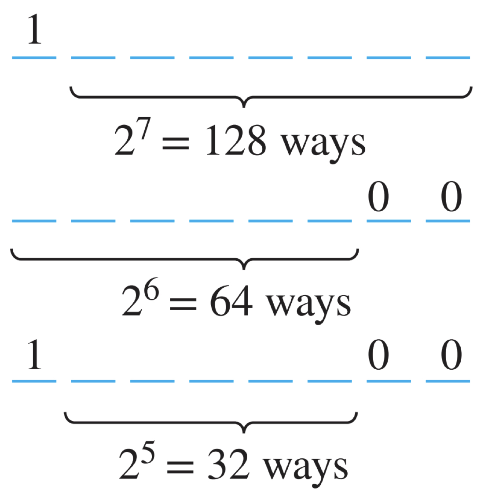
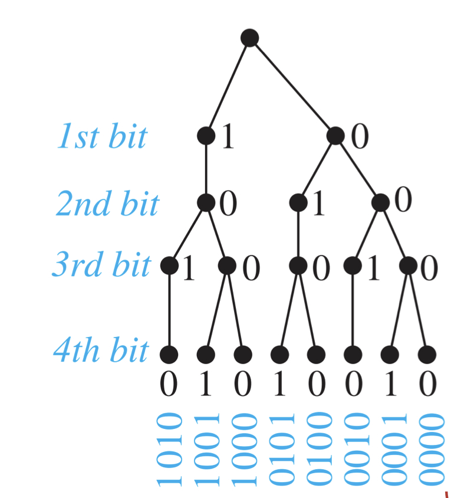
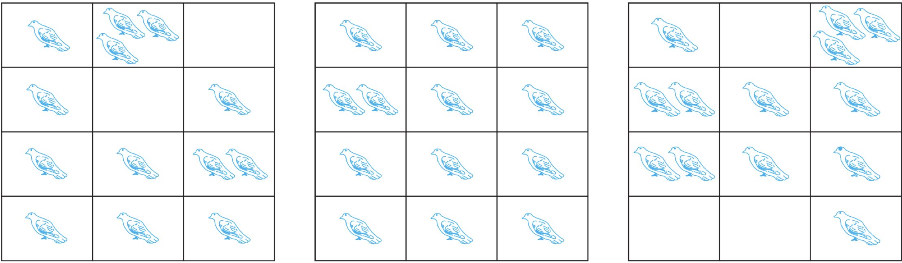
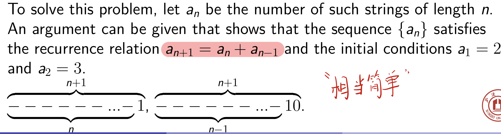
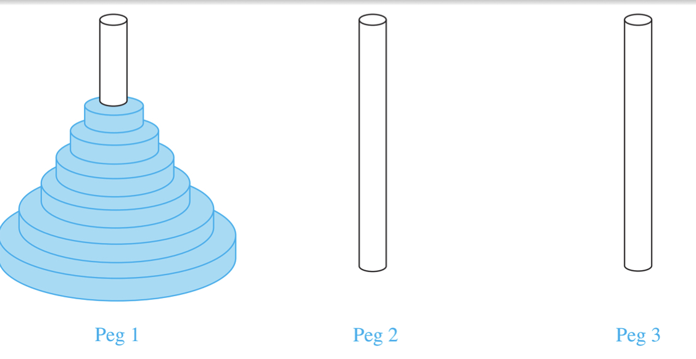

# the Basics of Counting

##  THE PRODUCT RULE(乘法原则)

+ 完成这个问题的几个步骤
+ 完成第一步n种方法，第二步m种方法
+ 则，n✖️m

##  THE SUM RULE（加法原则）

+ 完成这个可以用n种方法或者m种方法
+ n+m

## Examples of using both rules

 **EG1**：

>  Each user on a computer system has a password, which is six to eight characters long, where each character is an uppercase letter or a digit. Each password must contain at least one digit. How many possible passwords are there?
>
> **Solution:**
>
> $(36^6 −26^6)+(36^7 −26^7)+(36^8 −26^8)$
>
> 排除法

##  THE SUBTRACTION RULE（减法原理）

If a task can be done in either n1 ways or n2 ways, then the number of ways to do the task is n1 + n2 minus the number of ways to do the task that are **common** to the two different ways.

运用容斥原理做题：

 **EG2**：

>   How many bit strings of length eight either start with a 1 bit or end with the two bits 00?
>
> **Solution:**
>
>  Principle of inclusion-exclusion: $|A ∪ B| = |A| + |B| − |A ∩ B|$
>
> $2^7+2^6-2^5$
>
> 

##  THE DIVISION RULE(除法原理)

+ There are n/d ways to do a task if it can be done using a procedure that can be carried out in n ways, and for every way w, exactly d of the n ways correspond to way w.

 **EG3**：

> How many different ways are there to seat four people around a circular table, where two seatings are considered the same when each person has the same left neighbor and the same right neighbor?
>
> **Solution:**
>
> $4！/4$

## Tree Diagrams

+ Use a branch to represent each possible choice

+ Represent the possible outcomes by the leaves

 **EG4**：

> How many bit strings of length four do not have two consecutive 1s?
>
> **Solution:**
>
> 

# #the Pigeonhole Principle(鸽巢原理)/Dirichlet drawer principle(狄利克雷抽屉原理)

+  If k is a positive integer and k + 1 or more objects are placed into k boxes, then there is at least one box containing two or more of the objects.

## Corollary

+ A function f from a set with k+1 or more elements to a set with k elements is not one-to-one.

## The Generalized Pigeonhole Principle

+ If N objects are placed into k boxes, then there is at least one box containing at least **⌈N/k⌉** objects.

 **EG5**：

> a) How many cards must be selected from a standard deck of 52 cards to guarantee that at least three cards of the same suit are selected?
> b) How many must be selected from a standard deck of 52 cards to guarantee that at least three hearts are selected?
>
> **Solution:**
>
> $⌈N/4⌉\ge 3,N =9$
>
> $13\times 3+3$

## #Some Elegant Applications of the Pigeonhole Principle

 **EG6**：

> During a month with 30 days, a baseball team plays at least one game a day, but no more than 45 games. Show that there must be a period of some number of consecutive days during which the team must play exactly 14 games.
>
> **Solution:**
>
> 在一个月30天的时间里，一个棒球队每天至少完成1场比赛，一个月内总的完赛场次不超过45场，我们需要证明这一个月内必定存在连续的几天，在这连续的几天总共完成了14场比赛。
>
> 假设每天已完成的比赛数量为一个序列{$a_n$}，并且，$1\le n\le30$，要证明，当$1\le i \le j\le 30$时，$a_j=a_i+14$成立。
>
> 令A为{$a_n$}与{$a_n+14$}的集合，则这两个序列的项数为$|A|=60$
>
> 那么$15\le a_i+14\le 59$，项数为$|B|=59$
>
> 由此可知，$|A|>|B|$
>
> 最后，我们构建一个函数$f：A一>B$使得f(a)=b。由A＞B以及鸽笼原理可得，该函数并不是单射的。说A中存在两个元素
> 映射到B中的同一个元素。再由${a_n+14}$不存在重复项可知，存在$i\ne j$，使得$a_j=a_i+14$

 **EG7**：

>  Show that among any n + 1 positive integers not exceeding 2n there must be an integer that divides one of the other integers.
>
> **Solution:**
>
> Write the $𝑗$-$th$ integer as $𝑎_𝑗=2^{𝑏_𝑗}𝑐_𝑗$ where $𝑐_𝑗$ is odd.
>
> Since there are $𝑛$ odd integers in $1:2𝑛$ , and there are $𝑛+1$ $𝑎_{𝑗+1}$ , two of the $𝑐𝑗$ must be equal, say $𝑐_𝑢=𝑐_𝑣$.
>
> Then $𝑎_𝑢|𝑎_𝑣$ if $𝑏𝑢<𝑏𝑣$and $𝑎_𝑣|𝑎_𝑢$ if $𝑏_𝑣<𝑏_𝑢$.
>
> This is not original.

 **EG8**：

> Every sequence of $n^2 + 1$ distinct real numbers contains a subsequence of length n + 1 that is either strictly increasing or strictly decreasing.
>
> **Solution:**
>
> $⌈(n^2+1)/n⌉\ge n+1$

# Permutations and Combinations(排列组合)

## Permutations(排列)

### THEOREM

+ If $n$ is a positive integer and $r$ is an integer with $1 ≤ r ≤ n$, then there are

$$
P(n,r) = n(n−1)(n−2)···(n−r+1)
$$

r-permutations of a set with n distinct elements.

### COROLLARY

+ If $n$ and $r$ are integers with $0≤r≤n$,then
  $$
  P(n,r)= \frac {n!}{(n−r)!}
  $$

### Combinations（组合）

### THEOREM

+ The number of r-combinations of a set with n elements, where n is a nonnegative integer and r is an integer with 0 ≤ r ≤ n, equals

$$
C(n, r) = \frac {n!}{r!(n − r)!}
$$

# Binomial Coefficients and Identities（二项式系数和恒等式）

##  THE BINOMIAL THEROEM

+ Let x and y be variables, and let n be a nonnegative integer. Then

$$
(x+y)^n=\sum_{j=0}^nC(n,j)x^{n-j}y^j
$$

$$
\sum_{k=0}^nC(n,k)=2^n \\
\sum_{k=0}^n(-1)^kC(n,k)=0 \\
\sum_{k=0}^n2^kC(n,k)=3^n
$$

## #Pascal’s Identity

 Let n and k be positive integers with n ≥ k. Then
$$
C_{n+1}^k=C_n^{k-1}+C_n^{k}
$$

## Vandermonde’s Identity

Let m, n, and r be nonnegative integers with r not exceeding either m or n. Then
$$
C_{n+m}^r=\sum^r_{k=0}C^{r-k}_mC_n^k
$$

+ 即，把m+n个人分成两组，累加

因为$C_n^k=(C_n^{n-k})^2$
$$
C_{2n}^n=\sum^r_{k=0}(C_n^k)^2
$$
 Let n and r be nonnegative integers with r ≤ n. Then
$$
C^{r+1}_{n+1}=\sum^n_{j=r}C^r_j
$$

# Generalized Permutations and Combinations

## Permutations with Repetition 可重复的

+ The number of r-permutations of a set of n objects with repetition allowed is $n^r$.

## #Combinations with Repetition 可重复的 用隔板法

+ There are $C(n+r−1,r) = C(n+r−1,n−1)$ r-combinations from a set with n elements when repetition of elements is allowed.
+ 意思是，n种物品，共取r件，用这个方法。

 **EG9**：

>  How many ways are there to select five bills from a cash box containing `$1 bills, $2 bills, $5 bills, $10 bills, $20 bills, $50 bills, and $100 `bills? Assume that the order in which the bills are chosen does not matter, that the bills of each denomination are indistinguishable, and that there are at least five bills of each type.
>
> **Solution:**
>
> 七种钱，每个钱至少有五张，从中抽五张钱
>
> 七种钱，共取五张。
>
> 
>
> $C^5_{7+5-1}$

**EG10**：

> How many solutions does the equation
> $$
> x_1 + x_2 + x_3 = 11
> $$
> have, where x1, x2, and x3 are nonnegative integers?
>
> **Solution:**
>
> 三种物品，共取11件
>
> $C^{11}_{3+11-1}$

#**EG11**：

> How many solutions does the equation
> $$
> x_1 + x_2 + x_3 = 11
> $$
> have, where x1, x2, and x3 are nonnegative integers and x1 ≥1, x2 ≥2, x3 ≥3??
>
> **Solution:**
>
> $x_1-1\ge 0,x_2-2\ge0,x_3-3\ge0$
>
> 11-1-2-3=5
>
> 三种物品，共取五件
>
> $C^{5}_{3+5-1}$

## Summary

|      Type      | Repetition Allowed? |         Formula         |
| :------------: | :-----------------: | :---------------------: |
| r-premutations |         NO          |         P(n,r)          |
| r-combinations |         NO          |         C(n,r)          |
| r-premutations |         YES         |          $n^r$          |
| r-combinations |         YES         | C(n+r-1,n-1)=C(n+r-1,r) |

## *(不考)

### Permutations with Indistinguishable Objects*

**EG11**：

> How many different strings can be made by reordering the letters of the word SUCCESS?
>
> **Solution:**
>
> 把重复的除掉
>
> S重复了三次
>
> C重复了两次
> $$
> \frac{7!}{2!3!}
> $$

+  The number of different permutations of n objects, where there are n1 **indistinguishable** objects of type 1, n2 **indistinguishable** objects of type 2,..., and nk i**ndistinguishable** objects of type k, is
  $$
  \frac {n!}{n_1!n_2!···n_k!}
  $$

### Distributing Objects into Boxes*

**EG12**：

> How many ways are there to distribute hands of 5 cards to each of four players from the standard deck of 52 cards?
>
> **Solution:**
> $$
> \frac{A^{20}_{52} }{5!5!5!5!}
> $$
> 意思是说，52张牌里挑20张发下去，四个人里的五张牌的顺序无所谓

+  The number of ways to distribute n **distinguishable** objects into k **distinguishable** boxes so that ni objects are placed into **box**（意思排列顺序无所谓） i, i = 1,2,··· ,k, equals 
  $$
  \frac{n!}{n_1!n_2!···n_k!}
  $$

### Distinguishable Objects and Indistinguishable Boxes*

**EG12**：

>  How many ways are there to put four different employees into three indistinguishable offices, when each office can contain any number of employees?
>
> **Solution:**
> $$
> S(n, j) = \frac1{j!} \sum^{j−1}_{i=0} (−1)^iC^i_j(j − i)^n.
> $$

# Generating Permutations and Combinations

## Generating Permutations

+ Any set with n elements can be placed in **one-to-one correspondence** with the set {1, 2, 3, · · · , n}.
+ based on the **lexicographic (or dictionary)** 字典序的 ordering.
+ the permutation $a_1a_2 · · · a_n$ precedes the permutation of $b_1b_2 · · · b_n$, if for some k,with$1≤k≤n,a_1 =b_1,a_2 =b_2,···,a_{k−1} =b_{k−1}, and\  a_k < b_k$.

意思就是一堆排列出来的数字按照字典序列排起来

eg. 

+ The permutation 23415 of the set {1, 2, 3, 4, 5} precedes the permutation 23514.
+ The permutations of the set {1, 2, 3, 4, 5, 6} 
  + The next larger permutation after 234156 is 234165. 
  + The next larger permutation after 234165 is 234516.

**解题方法，找到升序——降序的拐点**

234165

升   升降

那么问题出在65

## Generating Combinations

+  use the correspondence between subsets of {a1, a2, · · · , an} and bit strings of length n
+ The bit string corresponding to a subset has a 1 in position k if ak is in the subset, and has a 0 in this position if ak is not in the subset.
+ 即，如果这个元素在总集合里挑出来的集合中，就是1；不在，那么就是0

### 补充

+ $S_1|S_2$:
  + 按位求或

+ $S_1\&S_2$
  + 按位求与
+ $n\&2^{k-1}$
  + 检查第k位是否为1

### The next binary expansion

+ The next binary expansion is found by
  + locating the first position from the right that is not a 1,
  + then changing all the 1s to the right of this position to 0s 
  + and making this first 0 (from the right) a 1.
  + 即二进制加法

EG：

>  Find the next bit string after 10 0010 0111.
>
> solution：
>
> 10 0010 0111+1=10 0010 1000

### Generating r-Combinations of the set {1, 2, ..., n}

+ An r-combination can be represented by a sequence containing the elements in the subset in increasing order.
+ The r-combinations can be listed using lexicographic order on these sequences.

+ the first r-combination is {1, 2, · · · , r−1, r}
+ the last r-combination is {n−r+1,n−r+2,··· ,n−1,n}

EG：

> Find the next larger 4-combination of the set {1, 2, 3, 4, 5, 6} after {1, 2, 5, 6}.
>
> solution：
>
> {1,3,4,5}

**#The next r-combination** 

+ The next r-combination after $a_1a_2 · · · a_r$ can be obtained:
  + First, locate the last element $a_i$ in the sequence such that $a_i\ne n−r+i$.
  + Then, replace $ai$ with $a_i +1$ and $a_j$ with $a_i +j−i+1$, for $j = i+1,i+2,··· ,r$
  + 有点抽象，看例子吧

Find the next larger 4-combination of the set {1, 2, 3, 4, 5, 6} after {1, 2, 5, 6}.
   {1,3,4,5}

# #Applications of Recurrence Relations

主要看example

> **EG1**:
>
> How many bit strings of length n do **not** contain **two consecutive zeros**?
>
> **Solution**:
>
> 

> **EG2**:
>
> 汉诺塔
>
> The rules of the puzzle allow disks to be moved one at a time from one peg to another as long as a disk is never placed on top of a smaller disk. Let Hn denote the number of moves needed to solve the Tower of Hanoi puzzle with n disks. Set up a recurrence relation for the sequence {Hn}.
>
> 
>
> **Solution**:
>
> $a_{n+1}=2a_n$
>
> $H_n=2^n-1$

> **EG3**:
>
> A computer system considers a string of decimal digits(十进制数字) a valid codeword if it contains an **even number** of 0 digits. For instance, 123**0**4**0**7869 is valid, whereas 12**0**987**0**456**0**8 is not valid. Let an be the number of valid n-digit codewords. Find a recurrence relation for an.
>
> **Solution**:
>
> $a_1 = 9$
>
> $a_n=9a_{n-1}+(10^{n-1}-a_{n-1})$
>
> 前面一半是：前n-1个0的个数已为偶数个，最后一个数在1-9里挑；后面一种情况是，前n-1个中的所有情况减去前n-1个里面已经有偶数个零的情况（即奇数个零），那么最后一位必然为0，✖️1.

>  **EG4**:
>
>  Find a recurrence relation for $C_n$, the number of ways to parenthesize the product of $n + 1$ numbers, $x_0 · x_1 · x_2 ···x_n$, to specify the order of multiplication. For example, $C_3 = 5$ because there are five ways to parenthesize $x_0 · x_1 · x_2 · x_3$ to determine the order of multiplication:
>
> 最后一次乘在第三个
>
> $C_2C_1=2\times1=2$
>
> $((x0 ·x1)·x2)·x3$; 
>
> $(x0 ·(x1 ·x2))·x3$;
>
> 最后一次乘在第二个乘
>
> $(x0 ·x1)·(x2 ·x3)$;
>
> 最后一次乘在第一个乘
>
> $x0 ·((x1 ·x2)·x3)$;
>
> $x0 ·(x1 ·(x2 ·x3))$.
>
> **Solution**:
>
> 明安图数
> $$
> C_n=\sum_{i=0}^{n-1}C_{n-1-i}C_i=\frac {C_{2n}^n} {(n+1)}
> $$
> 

# #Solving Linear Recurrence Relations

##  Linear Combinations with Constant Coefficients常系数线性组合

+ Linear **Homogeneous** 齐次 Recurrence Relations
+ Linear **Nonhomogeneous**非齐次 Recurrence Relations

## Solving Linear Homogeneous Recurrence Relations——THE DEGREE TWO CASE解齐次方程

### Theorem（两根不同）

+ Let $c_1$ and $c_2$ be real numbers. Suppose that $r^2−c_1r−c_2 = 0$ has **two distinct roots $r_1$ and $r_2$**. Then the sequence $\{a_n\}$ is a solution of the recurrence relation $a_n = c_1a_{n−1} + c_2a_{n−2}$ if and only if $a_n = α_1r^n_1 + α_2r^n_2$ for $n = 0,1,2,··· ,$ where $α_1$ and $α_2$ are constants.

即：

+ 已知$a_n = c_1a_{n−1} + c_2a_{n−2}$ 

+ 令 $r^2−c_1r−c_2 = 0$ 
+ 解出$r_1,r_2$
+ 得到式子$a_n = α_1r^n_1 + α_2r^n_2$

+ $a_0 =C_0,\ a_1 =C_1$
+ $a_0 =α_1 +α_2$, $a_1 =α_1r_1 +α_2r_2$. 
+ 用上面的式子解出 $α_1$ and $α_2$，就可以得到通式了

>  EX1:
>
>  Find an explicit formula for the Fibonacci numbers.
>
> Solution:
>
> $f_n = f_{n−1} + f_{n−2}$.
> The initial conditions $f_0 = 0$ and $f_1 = 1$.
> Characteristic equation: $r^2 − r − 1 = 0$.
> $$
> f_n=\frac{1}{\sqrt5}(\frac{1+\sqrt5}{2})^n-\frac{1}{\sqrt5}(\frac{1-\sqrt5}{2})^n
> $$

**The General Case:**

把原来的$a_n = α_1r^n_1 + α_2r^n_2$变成$a_n =α_1r^n_1 +α_2r^n_2 +···+α_kr^n_k$

>  EX2:
>
>  Find the solution to the recurrence relation $a_n = 6a_{n−1} − 11a_{n−2} + 6a_{n−3}$
>  with initial conditions $a_0 = 2$, $a_1 = 5$, and $a_2 = 15$.
>
>  Solution:
>
>  $r^3-6r^2+11r-6=0$
>
>  $(r-1)(r-2)(r-3)=0$
>
>  $r_1=1,r_2=2,r_3=3$
>
>  $a_0=α_1+α_2+α_3=2$
>
>  $a_1=α_1+2α_2+3α_3=5$
>
>  $a_2=α_1+4α_2+9α_3=15$
>
>  $α_1=1,α_2=-1,α_3=2$
>
>  $a_n = 1 − 2^n + 2 · 3^n.$

### Theorem（两根相同）

+ Let $c_1$ and $c_2$ be real numbers with $c_2\ne 0$. Suppose that $r_2 − c_1r − c_2 = 0$ has only one root $r_0$. A sequence $\{a_n\}$ is a solution of the recurrence relation $a_n = c_1a_{n−1} + c_2a_{n−2}$ if and only if $a_n = α_1r^n_0 + α_2nr^n_0$, for $n = 0, 1, 2, · · ·$ , where $α_1$ and $α_2$ are constants.

即：

+ 已知$a_n = c_1a_{n−1} + c_2a_{n−2}$ ，$c_2\ne 0$

+ 令 $r^2−c_1r−c_2 = 0$ 
+ 解出$r_0$
+ 得到式子$a_n = α_1r^n_0 + α_2nr^n_0$，注意，第二部分要乘n

+ $a_0 =C_0,\ a_1 =C_1$
+ $a_0 =α_1$, $a_1 =α_1r_0 +α_2r_0$. 
+ 用上面的式子解出 $α_1$ and $α_2$，就可以得到通式了

> EX1:
>
>  What is the solution of the recurrence relation $a_n = 6a_{n−1} − 9a_{n−2}$ with initial conditions $a_0 = 1$ and $a_1 = 6$?
>
> Solution:
>
> $r_0 = 3$.
> $an = 3^n + n3^n$.

**The General Case:**

用一个例子来说明

> + Suppose that the roots of the characteristic equation of a linear homogeneous recurrence relation are **2, 2, 2, 5, 5, and 9** (that is, there are three roots, the root 2 with multiplicity three, the root 5 with multiplicity two, and the root 9 with multiplicity one). What is the form of the general solution?
>
> + $(α_{1,0} + α_{1,1}n + α_{1,2}n^2)2^n + (α_{2,0} + α_{2,1}n)5^n + α_{3,0}9^n$.

> EX2:
>
> Find the solution to the recurrence relation $a_n = −3a_{n−1} − 3a_{n−2} − a_{n−3}$
> with initial conditions a0 = 1, a1 = −2, and a2 = −1.
>
> Solution:
>
> + $r^3+3r^2+3r+1=0$
> + $r_1=r_2=r_3=-1$
> + $a_n = α_{1,0}(−1)^n + α_{1,1}n(−1)^n + α_{1,2}n^2(−1)^n$
> + $a_0 =1=α_{1,0}$
> + $a_1 = −2 = −α_{1,0} −α_{1,1} −α_{1,2}$
> + $a_2 = −1 = α_{1,0} +2α_{1,1} +4α_{1,2}$
> + $a_n = (1 + 3n − 2n^2)(−1)^n$.

## Solving Linear Nonhomogeneous Recurrence Relations解非齐次方程

+ 形如：

+ $$
  a_n=c_1a_{n-1}+c_2a_{n-2}+...+c_ka_{n-k}+F(n)
  $$

+ F(n)是只依赖于n且不恒为0的函数，前半部分是齐次部分，叫做**相伴的齐次递推关系**

+ 解法（看下面两个例子就行）

>  EX1:
>
>  Find all solutions of the recurrence relation $a_n = 3a_{n−1} + 2n$. What is the solution with $a_1 = 3$?
>
> **Solution:**
>
> 通解：
>
> $r^2-3r=0, r_1=3, r_2=0$
>
> $a_n'=\alpha3^n$
>
> 令$a_n=\alpha3^n+cn+d$
>
> $a_n=3(\alpha3^{n-1}+c(n-1)+d)+2n=\alpha3^n+3cn-3c+3d+2n=\alpha3^n+(3c+2)n-3c+3d$
>
> $3c+2=c, c=-1$
>
> $-3c+3d=d, d=-3/2$

> EX2:
>
> Find all solutions of the recurrence relation $a_n = 5a_{n−1} − 6a_{n−2} + 7^n$.
>
> **Solution:**
>
> 通解：
>
> $r^2-5r+6=0, r_1=2, r_2=3$
>
> $a_n'=\alpha_13^n+\alpha_22^n$
>
> 令$a_n=\alpha_13^n+\alpha_22^n+c7^n$
>
> $a_n''=5c7^{n-1}-6c7^{n-2}+7^n=(29c+49)7^{n-2}$
>
> $29c+49=49c$
>
> $c=49/20$
>
> $a_n=\alpha_13^n+\alpha_22^n+(49/20)7^n$

